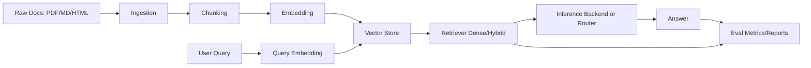
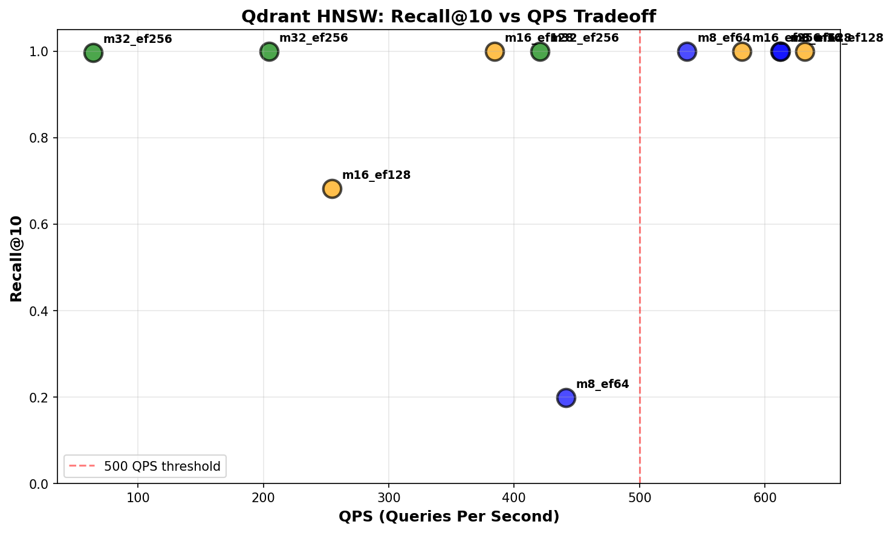
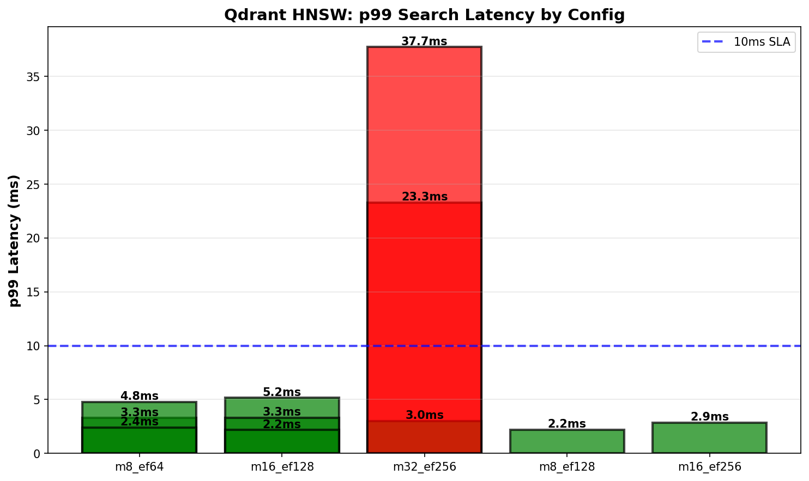
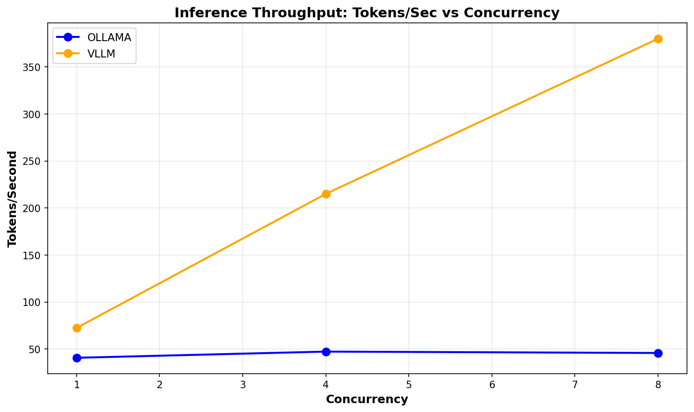
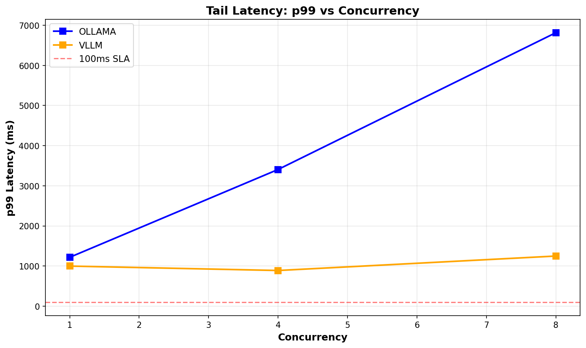
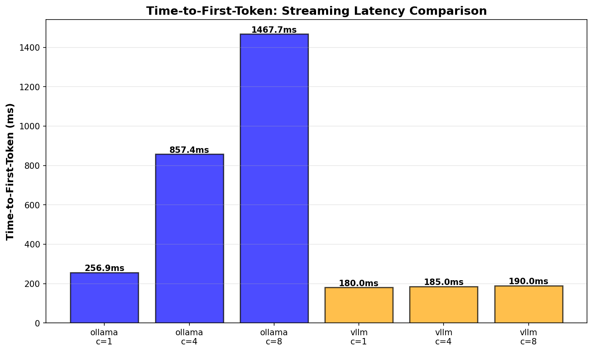

# InfraCore — Complete Project Deep Dive (Beginner to Advanced)

This document is a full learning companion for the InfraCore repository.

It is designed to be read in order:
1. what the project is
2. core AI/ML foundations
3. architecture and modules
4. file/class/function walkthroughs
5. real code reading with line-by-line explanations
6. end-to-end behavior, benchmarking, and evaluation thinking

The goal is to help a novice become confident while still giving advanced readers strong systems depth.

---

## 1. Project Introduction

### 1.1 What InfraCore Is
InfraCore is a backend-heavy AI infrastructure engine. It is not mainly a UI app. It focuses on the system layers that make AI features reliable and measurable.

Simple analogy:
- A normal AI app is the front counter.
- InfraCore is the kitchen, supply chain, quality checks, and performance dashboard behind it.

### 1.2 Why InfraCore Exists
Many AI demos only prove that a model can generate text once.
InfraCore addresses harder production-style questions:
1. How do we ingest noisy documents?
2. How do we split and index data for retrieval?
3. How do we choose and fail over inference backends?
4. How do we measure quality and performance continuously?

### 1.3 What “AI Infrastructure” Means in This Repository
In this codebase, AI infrastructure includes:
1. ingestion and document parsing
2. chunking and segmentation
3. embeddings and vectorization
4. vector database storage and ANN search
5. dense/hybrid retrieval
6. inference backend execution and routing
7. agent orchestration with tool use
8. evaluation and benchmarking frameworks

### 1.4 How It Differs from a Typical AI App
Typical AI app emphasis:
- prompt engineering and UI experience
- short-path integrations

InfraCore emphasis:
- typed contracts
- async I/O surfaces
- measurable tradeoffs (latency/throughput/recall)
- reproducible benchmark artifacts
- quality evaluation in CI context

### 1.5 Who This Project Is For
1. beginners learning how AI systems work beyond the model call
2. engineers moving into AI infrastructure roles
3. teams wanting a modular reference architecture for RAG-like systems

### 1.6 What Is Implemented vs In Progress (High Level)
Clearly implemented in `src/`:
- ingest parsers (PDF/Markdown/HTML)
- fixed + semantic chunking
- BGE + E5 embedders
- Qdrant + pgvector adapters
- dense + hybrid retrievers
- Ollama + vLLM backends + router fallback
- ReAct agent loop + tools
- lexical evaluation metrics + report generation

In-progress or partial signals:
- some docs mention broader multimodal ambitions than fully visible runtime code
- some integration/smoke references drift from current implementation names

### 1.7 Summary
InfraCore is an engineering-first AI backend project. It demonstrates how to build and measure AI systems, not just how to call one model endpoint.

### 1.8 Q&A
Q: Is InfraCore itself an LLM?
A: No. It is infrastructure around models.

Q: Is this codebase only research notes?
A: No. It has runnable modules, tests, benchmarks, and generated reports.

---

## 2. Big-Picture Architecture

### 2.1 End-to-End Flow


### 2.2 Data Flow and Control Flow
Data flow objects:
- text documents
- `Chunk` objects
- embedding arrays (`np.ndarray`)
- `SearchResult` and `RetrievalResult`
- `GenerationResult`
- evaluation report objects

Control flow logic:
- backend health checks and fallback routing
- agent step loop logic
- benchmark orchestration scripts

### 2.3 Why This Separation Matters
If each stage has a stable contract:
1. you can swap one implementation without rewriting everything
2. you can benchmark one layer independently
3. debugging is easier because boundaries are explicit

### 2.4 Architecture Recap
InfraCore is a pipeline system with modular boundaries. The design optimizes for extensibility, testing, and measurement.

### 2.5 Q&A
Q: Why not combine retrieval and inference into one file?
A: Separation keeps dependencies and failures isolated, and enables independent benchmarking.

---

## 3. Foundations Mini-Course (Deep Theory -> InfraCore Mapping)

This section is intentionally long. Read it as a course, not a glossary.

For each topic, we follow:
1. simple meaning
2. intuition
3. deeper explanation
4. concrete example
5. where it appears in InfraCore
6. implementation mapping
7. tradeoffs/problems
8. short summary
9. Q&A

---

### 3.1 Artificial Intelligence (AI)

#### 1) Simple Meaning
Artificial Intelligence (AI) is the broad field of building systems that perform tasks we associate with intelligence: perception, language, reasoning, planning, and decision-making.

#### 2) Intuition
Think of AI as a large city. ML and DL are two major neighborhoods, but not the whole city.

#### 3) Deeper Explanation
AI history matters because modern infra inherits old ideas:
1. symbolic AI: explicit rules, logic systems, theorem proving, planning
2. expert systems: rule bases built by domain experts
3. search/planning systems: graph search, optimization, decision trees
4. statistical AI: probabilistic learning from data
5. deep learning era: high-capacity representation learning from massive data

Important distinctions:
1. narrow AI (current reality): task-specialized systems
2. general AI (aspiration): broad cross-domain intelligence
3. reasoning-heavy systems vs pattern-recognition-heavy systems

Modern production AI is usually hybrid:
1. learned models do fuzzy understanding
2. deterministic infrastructure does validation, retrieval, routing, and control

#### 4) Example
In a RAG system, generation quality is model-driven, but reliability comes from infrastructure: retrieval, ranking, fallback, metrics, and evaluation.

#### 5) Where It Appears in InfraCore
1. learned model components: embedders, inference backends
2. deterministic control: router fallback, typed contracts, tool execution rules
3. quality governance: evaluation and benchmarking modules

#### 6) Implementation Mapping
1. `src/infracore/embedding/*` and `src/infracore/inference/*`: statistical/deep components
2. `src/infracore/inference/router.py`: control logic around uncertain model behavior
3. `src/infracore/eval/*`: system-level quality checks

#### 7) Tradeoffs/Problems
1. model-only systems are fluent but can hallucinate
2. rule-only systems are precise but brittle
3. practical systems combine both, increasing engineering complexity

#### 8) Summary
AI is not just model output. InfraCore demonstrates the engineering side that makes model behavior operationally trustworthy.

#### 9) Q&A
Q: Is fallback routing an AI algorithm?
A: Not directly. It is AI infrastructure that keeps AI behavior reliable.

---

### 3.2 Machine Learning (ML)

#### 1) Simple Meaning
ML is learning patterns from data rather than hand-writing every decision rule.

#### 2) Intuition
Instead of telling a machine all possible spam patterns, we show it many examples and let it learn regularities.

#### 3) Deeper Explanation
Core ML vocabulary:
1. dataset: examples
2. feature: measurable input attribute
3. label/target: expected output
4. model: function with parameters
5. training: parameter fitting process
6. validation: tuning checkpoint set
7. test set: final unbiased check

Learning paradigms:
1. supervised learning (labeled)
2. unsupervised learning (unlabeled structure discovery)
3. semi-supervised learning
4. self-supervised learning (labels derived from data itself)
5. reinforcement learning (reward-based sequential learning)
6. online learning (continuous updates)
7. batch learning (periodic retraining)

Task families:
1. classification
2. regression
3. ranking
4. clustering
5. dimensionality reduction

Generalization concepts:
1. overfitting
2. underfitting
3. bias-variance tradeoff
4. calibration

Classic ML algorithms (still important):
1. KNN
2. logistic regression
3. linear regression
4. decision trees
5. random forests
6. SVM

##### KNN in More Depth
KNN (k-nearest neighbors):
1. stores training points in feature space
2. computes distance between query point and stored points
3. predicts by majority vote (classification) or averaging (regression)

Why KNN matters to AI infra:
1. vector retrieval is nearest-neighbor search in embedding space
2. ANN indices (HNSW/IVF) are scalable approximations of neighbor search

#### 4) Example
Spam filtering:
1. supervised setting
2. features may include token statistics and embeddings
3. target is spam/not-spam

#### 5) Where It Appears in InfraCore
InfraCore mostly runs pretrained models at inference time, but ML ideas drive:
1. metric design
2. retrieval ranking interpretation
3. benchmark methodology

#### 6) Implementation Mapping
1. `benchmarks/*`: experimental design discipline from ML evaluation culture
2. `src/infracore/retrieval/hybrid_retriever.py`: rank fusion logic grounded in retrieval ML thinking
3. `src/infracore/eval/metrics.py`: measurement-first mindset

#### 7) Tradeoffs/Problems
1. simple models: fast and interpretable but may miss complex patterns
2. deep models: powerful but expensive to serve and monitor
3. metric choice can optimize the wrong behavior if poorly aligned

#### 8) Summary
ML gives predictive behavior; infrastructure makes that behavior observable, robust, and reproducible.

#### 9) Q&A
Q: If InfraCore does not train large models, why ML depth matters?
A: Because serving, retrieval, and evaluation decisions still depend on ML assumptions and failure modes.

---

### 3.3 Deep Learning (DL)

#### 1) Simple Meaning
Deep learning is ML with many-layer neural networks.

#### 2) Intuition
Early layers learn simple patterns; deeper layers compose them into richer representations.

#### 3) Deeper Explanation
Core mechanics:
1. forward pass: compute predictions
2. loss: quantify error
3. backpropagation: compute gradients
4. optimization (SGD/Adam): update parameters

Representation learning:
1. models discover intermediate features automatically
2. this reduces manual feature engineering

Training stability concepts:
1. vanishing/exploding gradients
2. normalization (batch/layer norm)
3. regularization (dropout, weight decay)

Why DL changed NLP:
1. contextual embeddings
2. large-scale pretraining
3. transfer learning across tasks

#### 4) Example
A sentence embedding model maps semantically similar sentences closer in vector space.

#### 5) Where It Appears in InfraCore
1. embedding backends consume pretrained transformer models
2. inference backends serve decoder-style language models

#### 6) Implementation Mapping
1. `src/infracore/embedding/bge_m3.py`
2. `src/infracore/embedding/e5_embedder.py`
3. `src/infracore/inference/ollama_backend.py`
4. `src/infracore/inference/vllm_backend.py`

#### 7) Tradeoffs/Problems
1. better model quality often means higher latency/cost
2. larger models demand better caching, batching, and fallback strategies

#### 8) Summary
DL drives capability; infra handles speed, memory, failure, and monitoring.

#### 9) Q&A
Q: Why does DL create infra pressure?
A: Model size, context length, and concurrency produce latency and memory bottlenecks.

---

### 3.4 Neural Networks (Perceptron, MLP, Representation Capacity)

#### 1) Simple Meaning
A neural network is a stack of differentiable transformations from input to output.

#### 2) Intuition
Each layer asks a slightly smarter question than the previous one.

#### 3) Deeper Explanation
Building blocks:
1. linear transformation: `Wx + b`
2. nonlinearity: ReLU/GELU/tanh
3. stacking layers: increases expressive power

Perceptron vs MLP:
1. perceptron is single-layer linear separator
2. MLP stacks hidden layers to model non-linear boundaries

NN theory relevance:
1. universal approximation (informal practical meaning)
2. capacity vs generalization tradeoff

#### 4) Example
A classifier turning an embedding vector into intent classes uses MLP-like readout layers.

#### 5) Where It Appears in InfraCore
InfraCore does not train NNs directly, but all embedders/LLMs it wraps are NN-based.

#### 6) Implementation Mapping
1. vector outputs from embedders are NN-learned representations
2. inference outputs are NN-generated token sequences

#### 7) Tradeoffs/Problems
1. expressiveness improves performance but reduces interpretability
2. reliability must be measured at system level, not assumed from model architecture

#### 8) Summary
NN foundations explain why vector semantics and LLM behavior exist in the first place.

#### 9) Q&A
Q: Why include NN basics in an infra project?
A: Because many infra choices (latency, dimension, batching) are direct consequences of NN model behavior.

---

### 3.5 CNNs (Convolutional Neural Networks)

#### 1) Simple Meaning
CNNs are neural networks tailored for spatial data such as images.

#### 2) Intuition
Convolution filters slide across an image to detect local patterns like edges and textures.

#### 3) Deeper Explanation
Key concepts:
1. kernels/filters
2. feature maps
3. pooling and stride
4. receptive field growth through depth
5. translation invariance tendencies

#### 4) Example
Document image OCR pipelines often include CNN-style visual encoders in older or hybrid architectures.

#### 5) Where It Appears in InfraCore
Not a central runtime component in `src/` today. It matters as background for future multimodal/document pipelines.

#### 6) Implementation Mapping
No dedicated CNN module is visible in current runtime codebase.

#### 7) Tradeoffs/Problems
1. strong local spatial modeling
2. less dominant than transformers in large text-first stacks

#### 8) Summary
CNN knowledge supports future multimodal expansion even if current implementation is mostly text-centric.

#### 9) Q&A
Q: Does InfraCore currently run CNN inference paths?
A: Not as a primary visible runtime flow.

---

### 3.6 RNN, LSTM, GRU (Historical Context for Modern Stacks)

#### 1) Simple Meaning
RNN-family models process sequences token by token while carrying hidden state.

#### 2) Intuition
They maintain a memory vector that gets updated at each timestep.

#### 3) Deeper Explanation
1. vanilla RNN suffers from vanishing gradients on long dependencies
2. LSTM adds gates (input/forget/output) to control memory flow
3. GRU simplifies gating while improving long-range modeling over vanilla RNN

Why transformers replaced them at scale:
1. better parallelization
2. stronger long-context behavior
3. better scaling with data/compute

#### 4) Example
Legacy seq2seq translation systems relied heavily on LSTMs before transformer adoption.

#### 5) Where It Appears in InfraCore
Mainly conceptual context; not a direct runtime module.

#### 6) Implementation Mapping
None as first-class code path in `src/infracore`.

#### 7) Tradeoffs/Problems
1. RNNs: efficient for streaming patterns, weaker at large-context modeling
2. transformers: stronger quality, heavier compute footprint

#### 8) Summary
RNN history helps explain why today’s infra must optimize transformer serving.

#### 9) Q&A
Q: Should RNNs be ignored now?
A: No. They remain useful for specific sequential efficiency scenarios.

---

### 3.7 Transformers, Tokenization, Attention, Context Windows

#### 1) Simple Meaning
Transformers model relationships between tokens using attention.

#### 2) Intuition
Every token can look at other tokens and decide which ones matter.

#### 3) Deeper Explanation
Tokenizer role:
1. converts text into token IDs
2. affects sequence length and cost
3. influences downstream model behavior

Attention role:
1. computes query-key similarity scores
2. weights values by attention distribution
3. repeated across heads for different interaction patterns

Architecture variants:
1. encoder-only (embedding/classification)
2. decoder-only (generation/LLM chat)
3. encoder-decoder (translation/summarization style)

Context window implications:
1. larger window improves grounding potential
2. compute and memory grow significantly
3. truncation and chunking become critical infra concerns

#### 4) Example
In RAG, retrieved contexts are inserted into prompt; token budget determines how much evidence fits.

#### 5) Where It Appears in InfraCore
1. embedding models (BGE/E5) are transformer-based
2. inference backends serve decoder-style models
3. chunking/retrieval policies indirectly manage context budget

#### 6) Implementation Mapping
1. chunk boundaries from `src/infracore/chunking/*` affect token-level prompt size
2. inference wrappers in `src/infracore/inference/*` execute model calls with token-related params

#### 7) Tradeoffs/Problems
1. long prompts improve context but increase latency and cost
2. truncation can drop crucial evidence
3. tokenizer differences can change effective capacity

#### 8) Summary
Tokenizer + attention + context budget are core operational concerns, not just model internals.

#### 9) Q&A
Q: Why is chunk overlap related to transformer context?
A: Overlap preserves boundary information so important details are less likely to be split away from surrounding context.

---

### 3.8 NLP Foundations

#### 1) Simple Meaning
NLP is computation over human language for understanding and generation.

#### 2) Intuition
Language has syntax (structure) and semantics (meaning); systems need both.

#### 3) Deeper Explanation
NLP pipeline components:
1. text normalization
2. tokenization
3. lexical signals (keywords, frequencies)
4. semantic signals (embeddings, contextual representations)
5. downstream tasks (classification, retrieval, QA, generation)

Classic terms:
1. stemming and lemmatization
2. n-grams
3. language modeling
4. sequence labeling

Modern text systems combine:
1. lexical retrieval for exact terms
2. semantic retrieval for meaning similarity
3. generative models for synthesis

#### 4) Example
Question answering pipeline:
1. parse query
2. retrieve relevant context
3. generate answer conditioned on retrieved evidence

#### 5) Where It Appears in InfraCore
InfraCore is strongly NLP-first today:
1. ingest parsers normalize text
2. embedders represent semantics
3. retrievers rank evidence
4. inference backends generate responses

#### 6) Implementation Mapping
1. `src/infracore/ingest/*`
2. `src/infracore/embedding/*`
3. `src/infracore/retrieval/*`
4. `src/infracore/inference/*`

#### 7) Tradeoffs/Problems
1. lexical signals miss paraphrases
2. semantic signals may miss exact rare entities
3. generated language can be fluent but unsupported

#### 8) Summary
InfraCore is essentially a modular NLP infrastructure system with explicit retrieval and evaluation layers.

#### 9) Q&A
Q: Is prompt engineering part of NLP infra?
A: Yes. In this repo it appears most clearly in the agent prompt builder.

---

### 3.9 Computer Vision (CV), OCR, and Document Intelligence

#### 1) Simple Meaning
CV extracts structured meaning from images and page layouts.

#### 2) Intuition
A scanned PDF is visual first, text second.

#### 3) Deeper Explanation
CV/document-intelligence tasks:
1. image classification
2. object detection
3. segmentation
4. OCR (image text extraction)
5. layout analysis (tables, headers, sections)

Document intelligence systems often combine:
1. OCR engine
2. layout parser
3. NLP post-processing

#### 4) Example
Invoice understanding: detect fields visually, then normalize extracted text semantically.

#### 5) Where It Appears in InfraCore
Current runtime code is mostly text extraction and text processing. Full OCR + layout pipeline is not visible as a complete first-class subsystem yet.

#### 6) Implementation Mapping
1. `PDFParser` extracts text from machine-readable PDFs
2. no dedicated OCR runtime module is visible in `src/`

#### 7) Tradeoffs/Problems
1. multimodal gains require more complex preprocessing and evaluation
2. OCR quality drift can silently degrade retrieval quality

#### 8) Summary
CV is important to InfraCore’s stated direction, but the current implemented core is text-first.

#### 9) Q&A
Q: Is multimodal retrieval production-ready in this repo today?
A: Not fully visible as a complete runtime path in current code.

---

### 3.10 LLM, VLM, MLLM

#### 1) Simple Meaning
1. LLM: large language model (text in/out)
2. VLM: vision-language model (image + text)
3. MLLM: multimodal language model (multiple input types)

#### 2) Intuition
Each extra modality increases capability and integration complexity.

#### 3) Deeper Explanation
LLM strengths:
1. broad language prior
2. flexible generation and instruction following

LLM weaknesses:
1. hallucination
2. weak uncertainty calibration
3. limited domain freshness without retrieval/tool grounding

VLM/MLLM additional challenges:
1. cross-modal alignment
2. visual grounding failures
3. modality-specific evaluation complexity

Current mitigation patterns in industry:
1. retrieval grounding (RAG)
2. tool-calling
3. policy-constrained prompting
4. output verification/evaluation loops

#### 4) Example
A model may answer confidently about a PDF section that is not actually present unless retrieval is correctly grounded.

#### 5) Where It Appears in InfraCore
LLM serving and orchestration are implemented; multimodal execution is more roadmap-facing.

#### 6) Implementation Mapping
1. `src/infracore/inference/ollama_backend.py`
2. `src/infracore/inference/vllm_backend.py`
3. `src/infracore/inference/router.py`
4. `src/infracore/agents/*` for tool-grounded reasoning

#### 7) Tradeoffs/Problems
1. quality gains often increase latency/cost
2. broader modality support increases failure surface area

#### 8) Summary
InfraCore is currently strong on text-first LLM infrastructure with multimodal aspirations.

#### 9) Q&A
Q: What is the practical difference between LLM and MLLM at infra level?
A: Input pipelines, model serving stack, and evaluation contracts all become more complex with additional modalities.

---

### 3.11 Embeddings, Semantic Search, Dense/Sparse/Hybrid Retrieval

#### 1) Simple Meaning
Embeddings convert text into vectors so semantic similarity can be computed numerically.

#### 2) Intuition
Words with similar meaning should land near each other in vector space.

#### 3) Deeper Explanation
Embedding concepts:
1. vector space geometry
2. cosine similarity vs dot product
3. normalization and its effect
4. query/document asymmetry (dual encoder conventions)
5. prefix tuning (E5 query/passage)

Retrieval paradigms:
1. dense retrieval: similarity in learned vector space
2. sparse retrieval: lexical scoring (BM25)
3. hybrid retrieval: combine dense and sparse rankings

Reciprocal Rank Fusion (RRF):
1. operates on rank positions, not raw scores
2. avoids score-scale mismatch between dense and sparse systems

#### 4) Example
Query: "SLA penalties for downtime"
1. sparse can catch exact legal phrase occurrences
2. dense can catch paraphrases like "service availability penalties"
3. hybrid generally improves robustness

#### 5) Where It Appears in InfraCore
1. BGE and E5 embedders
2. dense retriever
3. BM25 index
4. hybrid retriever with weighted RRF

#### 6) Implementation Mapping
1. `src/infracore/embedding/bge_m3.py`
2. `src/infracore/embedding/e5_embedder.py`
3. `src/infracore/retrieval/dense_retriever.py`
4. `src/infracore/retrieval/hybrid_retriever.py`

#### 7) Tradeoffs/Problems
1. dense-only may miss exact rare terms
2. sparse-only may miss semantic paraphrases
3. hybrid improves robustness but adds latency and implementation complexity

#### 8) Summary
Retrieval quality is a dominant driver of RAG quality, and InfraCore encodes this through explicit dense/sparse/hybrid modules.

#### 9) Q&A
Q: Why normalize embeddings?
A: To make cosine-style similarity comparisons more stable and comparable.

---

### 3.12 Vector Databases, ANN, HNSW, IVFFlat

#### 1) Simple Meaning
Vector DBs store embeddings and perform nearest-neighbor search quickly at scale.

#### 2) Intuition
Brute-force neighbor search is exact but too slow at large scale; ANN is an efficient approximation.

#### 3) Deeper Explanation
Key ANN ideas:
1. indexing structures approximate nearest neighbors
2. search explores only promising regions
3. recall-latency tradeoff is tunable

HNSW (Hierarchical Navigable Small World):
1. graph-based ANN structure
2. `m`: graph connectivity
3. `ef_construct`: build-time exploration
4. `ef`: query-time exploration

IVFFlat (commonly in pgvector contexts):
1. coarse partitioning
2. probe selected partitions
3. speed/recall controlled by probe counts and list sizing

#### 4) Example
Increasing HNSW `ef` can improve recall@k, but often increases p99 latency.

#### 5) Where It Appears in InfraCore
1. Qdrant adapter and benchmarks
2. pgvector adapter and schema/index management

#### 6) Implementation Mapping
1. `src/infracore/vectordb/qdrant_store.py`
2. `src/infracore/vectordb/pgvector_store.py`
3. `benchmarks/vectordb/*`

#### 7) Tradeoffs/Problems
1. specialized vector DBs can be faster/easier for ANN tuning
2. SQL-native vector paths simplify integration with relational workloads
3. configuration drift can silently alter recall or latency behavior

#### 8) Summary
Vector DB choices are core product decisions because they directly shape retrieval quality and response time.

#### 9) Q&A
Q: Why compare Qdrant and pgvector?
A: They represent different operational philosophies: specialized vector service vs integrated SQL ecosystem.

---

### 3.13 RAG, Hallucination, and Grounding

#### 1) Simple Meaning
RAG augments generation with retrieved external context.

#### 2) Intuition
Instead of trusting model memory alone, fetch evidence at answer time.

#### 3) Deeper Explanation
RAG stages:
1. ingest documents
2. chunk documents
3. embed chunks
4. index embeddings
5. retrieve top-k evidence
6. generate answer conditioned on evidence
7. evaluate answer and retrieval quality

Hallucination types:
1. unsupported factual claims
2. fabricated citations
3. overconfident wrong synthesis

How modern stacks mitigate hallucination:
1. stronger retrieval relevance
2. source attribution patterns
3. tool use for deterministic tasks
4. evaluation and regression testing

#### 4) Example
Without retrieval, a model may invent policy dates. With retrieval, it can anchor output to actual indexed policy text.

#### 5) Where It Appears in InfraCore
The full text-first RAG chain is visibly implemented across modules.

#### 6) Implementation Mapping
1. ingest: `src/infracore/ingest/*`
2. chunking: `src/infracore/chunking/*`
3. embedding: `src/infracore/embedding/*`
4. storage/retrieval: `src/infracore/vectordb/*`, `src/infracore/retrieval/*`
5. generation: `src/infracore/inference/*`
6. evaluation: `src/infracore/eval/*`

#### 7) Tradeoffs/Problems
1. retrieval adds latency
2. bad chunking can degrade retrieval significantly
3. context stuffing can reduce answer precision

#### 8) Summary
RAG is not one feature. It is a coordinated pipeline whose weakest stage often dominates output quality.

#### 9) Q&A
Q: Does more retrieved context always mean better answers?
A: No. Irrelevant or noisy context can hurt generation.

---

### 3.14 Agents, ReAct, and Tool Use

#### 1) Simple Meaning
Agents are loops where the model reasons, chooses actions/tools, observes results, then continues.

#### 2) Intuition
Some problems are solved better by combining language reasoning with deterministic tools.

#### 3) Deeper Explanation
ReAct loop:
1. Thought
2. Action
3. Action Input
4. Observation
5. Iterate until final answer or step limit

Infrastructure concerns:
1. parse stability of LLM outputs
2. tool safety and sandboxing
3. max-step guardrails
4. structured trace for debugging

#### 4) Example
Math query:
1. model identifies need for calculation
2. action calls calculator tool
3. observation returns deterministic result
4. final answer grounded on tool output

#### 5) Where It Appears in InfraCore
1. prompt builder
2. tool registry and tool implementations
3. ReAct runtime loop

#### 6) Implementation Mapping
1. `src/infracore/agents/prompt_builder.py`
2. `src/infracore/agents/tools.py`
3. `src/infracore/agents/react_agent.py`

#### 7) Tradeoffs/Problems
1. powerful but format-fragile
2. unsafe tool execution can be critical risk without validation

#### 8) Summary
Agent capability comes from orchestration quality, not just model intelligence.

#### 9) Q&A
Q: Why strict output formatting in agent prompts?
A: Because parsing ambiguity directly causes tool-execution failures.

---

### 3.15 Evaluation, Benchmarking, Observability, and Infra KPIs

#### 1) Simple Meaning
Evaluation measures answer quality, benchmarking measures performance, observability tracks runtime behavior continuously.

#### 2) Intuition
If you cannot measure it, you cannot improve it reliably.

#### 3) Deeper Explanation
Quality dimensions:
1. answer relevance
2. context recall
3. context precision
4. faithfulness
5. correctness

Performance dimensions:
1. throughput (requests/sec)
2. latency (p50/p95/p99)
3. TTFT (time to first token)
4. memory footprint

Reliability dimensions:
1. backend availability
2. fallback success rate
3. error rates by subsystem

Observability primitives:
1. counters (how often)
2. histograms (distribution)
3. gauges (current state)

#### 4) Example
A configuration that improves throughput by 30% but drops recall@10 by 15% may reduce end-user trust despite faster responses.

#### 5) Where It Appears in InfraCore
1. evaluation metrics/evaluator modules
2. benchmark suites under `benchmarks/`
3. Prometheus metrics in embedding, retrieval, vectordb, inference, and agent paths

#### 6) Implementation Mapping
1. `src/infracore/eval/metrics.py`
2. `src/infracore/eval/evaluator.py`
3. `benchmarks/vectordb/*`
4. `benchmarks/inference/*`
5. runtime instrumentation across core modules

#### 7) Tradeoffs/Problems
1. lexical metrics are deterministic but can miss semantic equivalence
2. richer model-judged eval is powerful but costly and sometimes less reproducible

#### 8) Summary
InfraCore treats measurable evaluation signals as a first-class engineering requirement, not optional reporting.

#### 9) Q&A
Q: Why is p99 latency emphasized?
A: Tail latency defines worst-case user experience under load.

---

### 3.16 Latency vs Throughput, Batching, Caching, Local vs Hosted Inference

#### 1) Simple Meaning
These are core operating levers for AI systems under real traffic.

#### 2) Intuition
You can make a system faster for each request or handle more requests overall, but often not both equally without tradeoffs.

#### 3) Deeper Explanation
1. latency: time to finish one request
2. throughput: requests handled per unit time
3. batching: combine many inputs for hardware efficiency
4. caching: reuse prior computation or responses
5. local inference: on your infra (more control, more ops burden)
6. hosted inference: provider-managed (less control, faster setup)

Tradeoff shape:
1. larger batches improve throughput but can increase per-request waiting time
2. aggressive caching lowers latency but risks stale outputs

#### 4) Example
Embedding in batches improves GPU utilization, but very large batch size can hurt tail latency.

#### 5) Where It Appears in InfraCore
1. batch embedding in BGE/E5 embedders
2. inference benchmarks by concurrency
3. router fallback for availability protection

#### 6) Implementation Mapping
1. `BGEEmbedder.embed` and `E5Embedder.embed` batching loops
2. inference benchmark reports under `benchmarks/inference/*`
3. `InferenceRouter` availability and fallback logic

#### 7) Tradeoffs/Problems
1. tuning for benchmarks may not match production traffic patterns
2. backend instability can dominate quality regardless of model strength

#### 8) Summary
Infra engineering is largely about managing latency/throughput/reliability tradeoffs explicitly.

#### 9) Q&A
Q: Why include both Ollama and vLLM wrappers?
A: To support model-serving choice flexibility and resilience via routing/fallback.

---

### 3.17 Prompt Engineering and Structured Outputs

#### 1) Simple Meaning
Prompt engineering is designing inputs so model outputs are useful, predictable, and parseable.

#### 2) Intuition
Prompt format is API design for models.

#### 3) Deeper Explanation
Prompt design goals:
1. constrain output schema
2. reduce ambiguity
3. improve tool-calling reliability
4. preserve chain context (scratchpad)

Failure modes:
1. malformed action blocks
2. mixed natural language + pseudo-JSON
3. prompt drift across model versions

#### 4) Example
ReAct prompt requires explicit fields (`Thought`, `Action`, `Action Input`, `Final Answer`) so parser can route actions safely.

#### 5) Where It Appears in InfraCore
Agent prompt construction and output parsing path.

#### 6) Implementation Mapping
1. `PromptBuilder.build_system_prompt`
2. `PromptBuilder.build_user_prompt`
3. `PromptBuilder.parse_llm_output`

#### 7) Tradeoffs/Problems
1. strict formatting improves reliability but may reduce model flexibility
2. parser logic must be robust to imperfect outputs

#### 8) Summary
Prompt design in infra is contract design, not just wording preference.

#### 9) Q&A
Q: Why parse model output with regex at all?
A: It provides deterministic structured extraction for tool dispatch in a lightweight setup.

---

### 3.18 Foundations Recap
You now have the conceptual map to read InfraCore as an engineered AI system:
1. models provide semantic and generative capabilities
2. infrastructure provides reliability, speed, and measurement
3. contracts connect every subsystem end-to-end

---

## 4. Concept-to-Project Mapping

| Concept | Where In Repo | Key Class/Function |
|---|---|---|
| Chunking | `src/infracore/chunking/` | `FixedChunker.chunk`, `SemanticChunker.chunk` |
| Embeddings | `src/infracore/embedding/` | `BGEEmbedder.embed`, `E5Embedder.embed` |
| Vector DB | `src/infracore/vectordb/` | `QdrantVectorStore.search`, `PgVectorStore.search` |
| Dense retrieval | `src/infracore/retrieval/dense_retriever.py` | `DenseRetriever.retrieve` |
| Hybrid retrieval | `src/infracore/retrieval/hybrid_retriever.py` | `HybridRetriever.retrieve` |
| Inference | `src/infracore/inference/` | backend `generate/chat` methods |
| Fallback routing | `src/infracore/inference/router.py` | `_get_available_backend` |
| Agent orchestration | `src/infracore/agents/` | `ReActAgent.run` |
| Tool safety | `src/infracore/agents/tools.py` | `CalculatorTool.call`, `_validate_ast` |
| Evaluation | `src/infracore/eval/` | metric `score` methods + evaluator |
| Benchmarking | `benchmarks/` | dataset generators, bench harnesses, report scripts |

### 4.1 What Breaks If Contracts Change
1. changing chunk schema can break embedding/retrieval expectations
2. changing vector dimensions without store schema updates breaks upsert/search
3. changing `payload` conventions breaks retriever text extraction
4. changing generation result schema breaks downstream reporting/agent assumptions

### 4.2 Recap
Theory maps directly onto concrete files and function contracts in this repository.

---

## 5. Repository Walkthrough

### 5.1 Runtime Core
- `src/infracore/ingest`
- `src/infracore/chunking`
- `src/infracore/embedding`
- `src/infracore/vectordb`
- `src/infracore/retrieval`
- `src/infracore/inference`
- `src/infracore/agents`
- `src/infracore/eval`

### 5.2 Testing Layers
- `tests/unit`: direct behavior tests for core modules
- `tests/integration`: broader pipeline-style checks
- `tests/smoke`: real-service smoke checks

### 5.3 Benchmark and Reporting Layers
- `benchmarks/chunking_bench.py`
- `benchmarks/vectordb/*`
- `benchmarks/inference/*`
- `benchmarks/eval_bench.py`
- `eval_reports/*` generated artifacts

### 5.4 Config and Ops
- `configs/default.yaml`
- `configs/eval_ci.yaml`
- `configs/prometheus.yml`
- `.github/workflows/eval_ci.yml`
- `docker-compose.yml`

### 5.5 Documentation and Planning Context
- `README.md`
- `ARCH_NOTES.md`
- sprint strategy/progress docs

### 5.6 Recap
The structure cleanly separates runtime logic, tests, benchmarking, and operational configuration.

---

## 6. Libraries and Dependencies (Deeply Explained)

### 6.1 Core Runtime Libraries

#### Pydantic (`pydantic`)
What it is:
1. data validation and schema modeling library.

Why used here:
1. configs are contracts in this repo.
2. typed validation catches runtime config mistakes early.

Where used:
1. config models across `chunking`, `embedding`, `retrieval`, `vectordb`, `inference`, `eval`, `agents`.

Alternatives:
1. dataclasses + manual validation
2. attrs + validators

Tradeoff:
1. slightly more boilerplate
2. much stronger safety and clarity

#### NumPy (`numpy`)
What it is:
1. core numerical array library in Python.

Why used here:
1. embeddings and vector operations are array-native.
2. benchmark calculations use vectorized math.

Where used:
1. embedder return types
2. vector-store query payload prep
3. benchmarking utilities

Alternatives:
1. pure Python lists (slow)
2. PyTorch tensors end-to-end (possible but tighter coupling)

Tradeoff:
1. conversion overhead at API boundaries
2. excellent interoperability and performance

#### Sentence Transformers + Transformers + Torch
What they are:
1. `sentence-transformers`: easy sentence embedding pipeline wrappers.
2. `transformers`: model ecosystem and tokenizer/model interfaces.
3. `torch`: tensor runtime and hardware acceleration backend.

Why used here:
1. practical way to load and run BGE/E5 embedding models.
2. device-aware model execution (`cuda/mps/cpu` selection).

Where used:
1. `src/infracore/embedding/bge_m3.py`
2. `src/infracore/embedding/e5_embedder.py`

Alternatives:
1. ONNX Runtime deployment
2. TensorRT or other accelerated serving stacks

Tradeoff:
1. larger dependency/runtime footprint
2. strong model compatibility and developer velocity

#### Qdrant Client (`qdrant-client`)
What it is:
1. Python client for Qdrant vector database.

Why used here:
1. async operations for vector upsert/search/delete/count.

Where used:
1. `src/infracore/vectordb/qdrant_store.py`

Alternatives:
1. direct REST calls
2. other vector DB clients (Milvus, Weaviate, Pinecone SDKs)

Tradeoff:
1. external service dependency
2. specialized ANN capability and clean API surface

#### PostgreSQL Async Client (`asyncpg`) + pgvector ecosystem
What it is:
1. high-performance async PostgreSQL driver.

Why used here:
1. SQL-native vector storage/search path.

Where used:
1. `src/infracore/vectordb/pgvector_store.py`

Alternatives:
1. psycopg async mode
2. ORMs with async support

Tradeoff:
1. manual SQL management required
2. gives full control and relational integration

#### HTTP Client (`httpx`)
What it is:
1. async-capable HTTP client with timeouts and modern API ergonomics.

Why used here:
1. inference backends are remote HTTP APIs (Ollama and vLLM endpoints).

Where used:
1. `src/infracore/inference/ollama_backend.py`
2. `src/infracore/inference/vllm_backend.py`
3. URL ingestion in `src/infracore/ingest/html_parser.py`

Alternatives:
1. aiohttp
2. requests (sync only)

Tradeoff:
1. network error handling complexity
2. async compatibility and clean API

#### Metrics Library (`prometheus-client`)
What it is:
1. instrumentation library for counters/histograms/gauges.

Why used here:
1. makes latency/throughput/error signals observable.

Where used:
1. embeddings, retrieval, vector stores, inference, ingestion, agents.

Alternatives:
1. OpenTelemetry metrics SDK
2. custom logging-only metrics

Tradeoff:
1. metric naming discipline required
2. strong operational visibility

#### Structured Logging (`structlog`)
What it is:
1. structured logging framework that emits machine-parsable logs.

Why used here:
1. tool execution and agent traces are easier to analyze with structured fields.

Where used:
1. `src/infracore/agents/tools.py`

Tradeoff:
1. setup complexity vs plain `print`
2. much better searchability and log analytics

#### Parsing/Extraction Libraries (`pypdfium2`, `html2text`, `markdown`, `python-docx`)
What they are:
1. `pypdfium2`: PDF text extraction
2. `html2text`: HTML to plain text conversion
3. `markdown`: markdown processing utility dependency
4. `python-docx`: DOCX support dependency scaffold

Why used here:
1. ingestion quality depends on reliable text extraction from heterogeneous sources.

Where used:
1. active runtime usage is visible for PDF/HTML parsing modules.
2. some dependencies are present for broader document-support direction.

Tradeoff:
1. extraction quality varies by source complexity
2. practical coverage for common enterprise document formats

### 6.2 Test/Benchmark Libraries
#### Testing
1. `pytest`: test runner and assertion framework.
2. `pytest-asyncio`: async coroutine test support.
3. `respx`: HTTPX request mocking for backend tests.

Why they matter:
1. async-heavy code needs async-native test harnesses.
2. inference adapters can be tested without hitting real services.

#### Benchmarking and Reporting
1. `matplotlib`: chart rendering for benchmark reports.
2. `psutil`: process/system metrics (CPU/memory) for performance analysis.
3. `tqdm`: progress bars for long-running benchmark jobs.
4. `scipy` and `scikit-learn`: numerical/statistical utilities used in bench/eval workflows.

Why they matter:
1. benchmark outputs become interpretable artifacts, not raw numbers.

### 6.3 Runtime/Framework Dependencies Present in Project Metadata
These appear in `requirements.txt`/`pyproject.toml` and reflect broader stack direction:
1. `fastapi`, `uvicorn`: API serving layer dependencies (useful for deployment-facing interfaces).
2. `pydantic-settings`, `python-dotenv`, `pyyaml`: configuration management and environment loading.
3. `datasets`, `ragas`: evaluation/data experimentation ecosystem dependencies.

Note:
1. some dependencies are strategic or preparatory and may have lighter direct usage in current runtime files.

### 6.4 Recap
Dependencies are chosen around five goals:
1. strict contracts and config safety
2. async I/O and backend reliability
3. vector retrieval and model-serving interoperability
4. measurable observability and evaluation
5. reproducible benchmarking and report generation

---

## 7. Code Quality and Engineering Standards

### 7.1 Strong Patterns (Detailed)

#### Pattern 1: Contract-first module design
Meaning:
- each subsystem starts with `base.py` contract classes.

Why it matters:
- stable interfaces reduce coupling.

Where seen:
- chunking, embedding, vectordb, retrieval, inference, eval, ingest, agents.

Maintainability impact:
- easier to add alternative implementations.

#### Pattern 2: Async-first external I/O surfaces
Meaning:
- network/DB/blocking IO are async or thread-offloaded.

Why it matters:
- better concurrency and responsiveness.

Where seen:
- inference HTTP calls
- qdrant/pgvector operations
- ingestion wrappers
- evaluator concurrent metric execution

Reliability impact:
- reduces event-loop blocking risk.

#### Pattern 3: Immutable-style config via `ConfigDict(frozen=True)`
Meaning:
- many configs are treated as immutable runtime contracts.

Why it matters:
- predictable behavior and fewer accidental mutations.

#### Pattern 4: Structured result objects
Meaning:
- outputs like `SearchResult`, `RetrievalResult`, `GenerationResult` provide explicit fields.

Why it matters:
- safer composition and cleaner tests.

#### Pattern 5: Early metrics instrumentation
Meaning:
- counters/histograms/gauges wired into core functions.

Why it matters:
- easier production-like monitoring and regression detection.

#### Pattern 6: Extensive unit tests
Meaning:
- key modules have targeted tests including edge cases.

Why it matters:
- confidence during iterative development.

### 7.2 Tradeoffs and Technical Debt

#### Debt 1: Interface drift in some docs/tests
Impact:
- cognitive overhead and potential test breakage.

#### Debt 2: Duplicate conceptual classes
Impact:
- ambiguity over canonical interfaces.

#### Debt 3: Outdated import/name references in some broader tests
Impact:
- friction when running full suites.

#### Debt 4: Mixed synthetic and real benchmark artifacts
Impact:
- readers may misinterpret results if not clearly labeled.

#### Debt 5: Minor naming/contract inconsistencies
Impact:
- onboarding complexity and maintenance drag.

### 7.3 Recap
The repository shows strong engineering judgment with clear modularity and measurement discipline, while still needing consistency cleanup expected in active development.

---

## 8. File-by-File Deep Walkthrough

This section is intentionally practical: file responsibility, class role, method contracts, and dependency connections.

### 8.1 `src/infracore/chunking/base.py`
File purpose:
1. defines the chunking contract layer for all chunking strategies.

Classes and methods:
1. `ChunkConfig`: strategy parameters (`strategy`, `max_tokens`, `overlap`, `min_chunk_size`), immutable-style via frozen model config.
2. `Chunk`: dataclass-like output object (`text`, `start_idx`, `end_idx`, `metadata`) shared across chunkers.
3. `BaseChunker.__init__`: stores config.
4. `BaseChunker.chunk`: abstract async contract that all chunkers must implement.

Why this matters:
1. downstream embedding/retrieval code can consume any chunker implementation as long as this contract is respected.

### 8.2 `src/infracore/chunking/fixed.py`
File purpose:
1. fast deterministic baseline chunking by word windows.

Class and methods:
1. `FixedChunker.chunk`

Internal design:
1. whitespace tokenization (`split`)
2. sliding window with overlap
3. guard against tiny tail chunks
4. computes source span offsets for traceability
5. metadata includes strategy and word counts

Dependency and contract:
1. provides predictable chunk shapes for embedding stage.
2. if metadata keys change, analysis/debug pipelines may break.

### 8.3 `src/infracore/chunking/semantic.py`
File purpose:
1. produce more meaning-preserving chunks by respecting sentence boundaries.

Class and methods:
1. `SemanticChunker.chunk`
2. `SemanticChunker._split_into_sentences`

Internal design:
1. regex-driven sentence splitting with abbreviation safeguards
2. chunk assembly based on sentence accumulation
3. overlap by sentence count (not raw words), improving discourse continuity

Tradeoff:
1. higher quality context boundaries than fixed chunks
2. more algorithmic complexity and regex edge cases

### 8.4 `src/infracore/embedding/base.py`
File purpose:
1. unify embedder contract and base config.

Classes and methods:
1. `EmbedConfig`: model name, batch size, max length, normalization flag.
2. `BaseEmbedder.__init__`
3. `BaseEmbedder.embed` (abstract async batch API)

Why class-based design:
1. embedder instances hold reusable model state and config.
2. contract makes backends interchangeable.

### 8.5 `src/infracore/embedding/bge_m3.py`
File purpose:
1. concrete embedder implementation for BAAI BGE-M3.

Class and methods:
1. `BGEEmbedder.__init__`
2. `BGEEmbedder._detect_device`
3. `BGEEmbedder.embed`
4. `BGEEmbedder.embed_single`
5. `BGEEmbedder._normalize_embeddings`

Implementation highlights:
1. detects `cuda > mps > cpu`
2. batch encode loop
3. optional L2 normalization
4. float32 output normalization for consistency
5. Prometheus metrics on volume and latency

### 8.6 `src/infracore/embedding/e5_embedder.py`
File purpose:
1. E5-specific embedding behavior with query/passage prefixes.

Classes and methods:
1. `E5EmbedConfig`
2. `E5Embedder.__init__`
3. `E5Embedder._detect_device`
4. `E5Embedder._add_prefix`
5. `E5Embedder.embed`
6. `E5Embedder.embed_single`
7. `E5Embedder._normalize_embeddings`

Implementation highlights:
1. explicit query/passage mode contract
2. prefix injection before encoding
3. same batching/metrics shape as BGE, improving cross-model operational consistency

### 8.7 `src/infracore/vectordb/base.py`
File purpose:
1. backend-agnostic vector store contract.

Classes and methods:
1. `VectorStoreConfig`
2. `SearchResult`
3. `BaseVectorStore.__init__`
4. `BaseVectorStore.upsert` (abstract)
5. `BaseVectorStore.search` (abstract)

Contract importance:
1. retrieval code depends on `SearchResult(id, score, payload)` fields.

### 8.8 `src/infracore/vectordb/qdrant_store.py`
File purpose:
1. Qdrant adapter with collection lifecycle and ANN operations.

Classes and methods:
1. `QdrantConfig`
2. `QdrantVectorStore.__init__`
3. `create_collection`
4. `delete_collection`
5. `upsert`
6. `search`
7. `delete`
8. `count`

Implementation highlights:
1. async Qdrant client use
2. numpy -> list serialization for API
3. payload persistence for retrieval context
4. operation/latency metrics

### 8.9 `src/infracore/vectordb/pgvector_store.py`
File purpose:
1. PostgreSQL + pgvector adapter for teams preferring SQL-centric infrastructure.

Classes and methods:
1. `PgVectorConfig`
2. `PgVectorStore.__init__`
3. `_get_pool`
4. `create_table`
5. `upsert`
6. `search`
7. `delete`
8. `count`
9. `close`

Implementation highlights:
1. lazy asyncpg pool creation
2. DDL creation for vector table/index
3. `ON CONFLICT` upsert pattern
4. pgvector distance operator usage in search

### 8.10 `src/infracore/retrieval/base.py`
File purpose:
1. retrieval output contract and base retriever interface.

Classes and methods:
1. `RetrieverConfig`
2. `RetrievalResult`
3. `BaseRetriever.__init__`
4. `BaseRetriever.retrieve` (abstract)

### 8.11 `src/infracore/retrieval/dense_retriever.py`
File purpose:
1. simple dense retrieval baseline built on embedder + vector store.

Classes and methods:
1. `DenseConfig`
2. `DenseRetriever.__init__`
3. `DenseRetriever.retrieve`

Implementation highlights:
1. query embedding
2. vector search
3. score threshold filtering
4. payload-to-result mapping
5. latency and request metrics

### 8.12 `src/infracore/retrieval/hybrid_retriever.py`
File purpose:
1. combine semantic and lexical retrieval using weighted reciprocal-rank fusion.

Classes and methods:
1. `HybridConfig`
2. `BM25Index.__init__`
3. `BM25Index.build`
4. `BM25Index.search`
5. `BM25Index._tokenize`
6. `HybridRetriever.__init__`
7. `HybridRetriever.build_index`
8. `HybridRetriever.retrieve`
9. `HybridRetriever.bm25_search`

Implementation highlights:
1. in-memory BM25 with document statistics
2. dense and sparse candidate generation
3. weighted RRF fusion
4. unified `RetrievalResult` output

### 8.13 `src/infracore/ingest/base.py`
File purpose:
1. normalize ingestion contract across PDF/HTML/Markdown.

Classes and methods:
1. `IngestConfig`
2. `IngestedDocument`
3. `BaseIngester.__init__`
4. `BaseIngester.ingest` (abstract)

### 8.14 `src/infracore/ingest/pdf_parser.py`
File purpose:
1. parse PDFs into text plus metadata with robust error signaling.

Classes and methods:
1. `IngestError`
2. `IngestResult.__post_init__`
3. `PDFConfig`
4. `PDFParser.__init__`
5. `PDFParser.ingest`
6. `PDFParser._extract_pdf`

Implementation highlights:
1. thread offload for blocking extraction
2. whitespace normalization options
3. min-char page filtering
4. skip-page tracking metadata

### 8.15 `src/infracore/ingest/markdown_parser.py`
File purpose:
1. parse markdown into clean text and metadata.

Classes and methods:
1. `MarkdownConfig`
2. `MarkdownParser.__init__`
3. `MarkdownParser.ingest`
4. `MarkdownParser._extract_markdown`
5. `MarkdownParser._extract_frontmatter`

Implementation highlights:
1. optional frontmatter and code-block stripping
2. metadata extraction for provenance and debugging

### 8.16 `src/infracore/ingest/html_parser.py`
File purpose:
1. convert HTML from URL/file/raw into readable text.

Classes and methods:
1. `TitleExtractor.__init__`
2. `TitleExtractor.handle_starttag`
3. `TitleExtractor.handle_endtag`
4. `TitleExtractor.handle_data`
5. `HTMLConfig`
6. `HTMLParser.__init__`
7. `HTMLParser.ingest`
8. `HTMLParser._fetch_url`
9. `HTMLParser._read_file`
10. `HTMLParser._extract_title`
11. `HTMLParser._convert_to_text`

Implementation highlights:
1. source-type detection
2. URL fetching with timeout/user-agent settings
3. HTML-to-text normalization

### 8.17 `src/infracore/inference/backend_base.py`
File purpose:
1. inference backend contract and shared result model.

Classes and methods:
1. `InferenceError`
2. `GenerationResult`
3. `BackendConfig`
4. `BaseInferenceBackend.__init__`
5. `BaseInferenceBackend.generate`
6. `BaseInferenceBackend.chat`
7. `BaseInferenceBackend.is_available`
8. `BaseInferenceBackend.list_models`

Contract importance:
1. router and agents rely on consistent generation result schema.

### 8.18 `src/infracore/inference/ollama_backend.py`
File purpose:
1. Ollama-specific model serving adapter.

Classes and methods:
1. `OllamaConfig`
2. `OllamaBackend.__init__`
3. `OllamaBackend.generate`
4. `OllamaBackend.chat`
5. `OllamaBackend.is_available`
6. `OllamaBackend.list_models`

Implementation highlights:
1. async HTTP API calls
2. response normalization to `GenerationResult`
3. backend-specific token/latency metric recording

### 8.19 `src/infracore/inference/vllm_backend.py`
File purpose:
1. vLLM OpenAI-compatible inference adapter.

Classes and methods:
1. `VLLMConfig`
2. `VLLMBackend.__init__`
3. `VLLMBackend.generate`
4. `VLLMBackend.chat`
5. `VLLMBackend.is_available`
6. `VLLMBackend.list_models`

Implementation highlights:
1. OpenAI-style endpoint compatibility
2. similar contract shape as Ollama backend for router interoperability

### 8.20 `src/infracore/inference/router.py`
File purpose:
1. availability-aware backend selector with fallback logic.

Classes and methods:
1. `RouterConfig`
2. `InferenceRouter.__init__`
3. `InferenceRouter._check_backend_available`
4. `InferenceRouter._get_available_backend`
5. `InferenceRouter.generate`
6. `InferenceRouter.chat`
7. `InferenceRouter.get_active_backend`
8. `InferenceRouter.is_available`
9. `InferenceRouter.list_models`

Implementation highlights:
1. lock-protected backend decision path
2. short-lived health cache
3. explicit error semantics for all-down conditions

### 8.21 `src/infracore/eval/base.py`
File purpose:
1. base evaluation data contracts.

Classes and methods:
1. `EvalConfig`
2. `EvalSample`
3. `EvalReport`
4. `BaseEvaluator.__init__`
5. `BaseEvaluator.evaluate` (abstract)

### 8.22 `src/infracore/eval/metrics.py`
File purpose:
1. metric implementations for deterministic RAG quality checks.

Classes and methods:
1. `MetricResult`
2. `AnswerRelevanceMetric.__init__`, `_extract_keywords`, `score`
3. `ContextRecallMetric.__init__`, `_split_sentences`, `score`
4. `ContextPrecisionMetric.__init__`, `_extract_keywords`, `score`
5. `FaithfulnessMetric.__init__`, `_extract_keywords`, `_split_sentences`, `score`
6. `AnswerCorrectnessMetric.__init__`, `_tokenize`, `score`

Implementation highlights:
1. lexical overlap-based scoring
2. thread-offloaded synchronous text ops
3. typed per-metric results

### 8.23 `src/infracore/eval/evaluator.py`
File purpose:
1. orchestrate metric execution and write markdown/json reports.

Classes and methods:
1. `EvalConfig`
2. `EvalReportData`
3. `RAGEvaluator.__init__`
4. `RAGEvaluator.evaluate`
5. `RAGEvaluator.save_report`
6. `RAGEvaluator._render_markdown`
7. `RAGEvaluator._render_json`
8. `RAGEvaluator.print_summary`

Implementation highlights:
1. per-sample metric parallelism via `asyncio.gather`
2. aggregate scoring and pass/fail gate
3. human-readable and machine-readable report outputs

### 8.24 `src/infracore/agents/base.py` and `src/infracore/agents/prompt_builder.py`
File purpose:
1. define agent/result/tool base contracts and prompt formatting/parsing logic.

Classes and methods:
1. `agents/base.py`: `AgentConfig`, `AgentResult`, `BaseTool.execute`, `BaseAgent.run`
2. `prompt_builder.py`: `Step`, `ParsedAction`, `PromptBuilder.build_system_prompt`, `build_user_prompt`, `parse_llm_output`

Design significance:
1. prompt format is treated as a machine contract, not free text.

### 8.25 `src/infracore/agents/tools.py`
File purpose:
1. tool abstractions and built-in tool implementations with safety checks.

Classes and methods:
1. `ToolError`
2. `ToolResult.__init__`
3. `BaseTool.__init__`, `BaseTool.call`
4. `RAGSearchTool.__init__`, `RAGSearchTool.call`
5. `CalculatorTool.__init__`, `CalculatorTool.call`, `CalculatorTool._validate_ast`
6. `WordCountTool.__init__`, `WordCountTool.call`
7. `CurrentTimeTool.__init__`, `CurrentTimeTool.call`
8. `ToolRegistry.__init__`, `register`, `get`, `list_tools`

Design significance:
1. security-sensitive code path (safe eval boundaries in calculator)
2. registry enables extensibility and controlled tool exposure

### 8.26 `src/infracore/agents/react_agent.py`
File purpose:
1. run the ReAct control loop end-to-end.

Classes and methods:
1. `AgentConfig`
2. `AgentResult`
3. `ReActAgent.__init__`
4. `ReActAgent.run`
5. `ReActAgent.run_stream`

Implementation highlights:
1. bounded max-step loop
2. prompt -> parse -> act -> observe cycle
3. structured failure/success outputs
4. metrics for run success, latency, and step counts

### 8.27 Recap
The repository’s file layout shows strong separation of concerns:
1. contracts in `base.py` files
2. concrete adapters per backend/strategy
3. orchestration layers (retrieval, router, agent, evaluator) that connect modules through typed boundaries.

---

## 9. Code Reading Labs (Real Code + Line-by-Line Explanation)

This section uses real code copied from repository functions and explains them step by step.

### 9.1 `FixedChunker.chunk`

```python
async def chunk(self, text: str) -> List[Chunk]:
    if not text or not text.strip():
        return []

    # Split into words
    words = text.split()
    if not words:
        return []

    chunks: List[Chunk] = []
    current_start_word_idx = 0

    while current_start_word_idx < len(words):
        # Get chunk of max_tokens words
        chunk_end_word_idx = min(
            current_start_word_idx + self.config.max_tokens, len(words)
        )
        chunk_words = words[current_start_word_idx:chunk_end_word_idx]

        # Skip if chunk is too small
        if len(chunk_words) < self.config.min_chunk_size:
            break

        # Find byte positions for start_idx and end_idx
        chunk_text = " ".join(chunk_words)

        # Calculate start byte index in original text
        start_text = " ".join(words[:current_start_word_idx])
        if start_text:
            start_idx = len(start_text) + 1  # +1 for space
        else:
            start_idx = 0

        # Calculate end byte index
        end_text = " ".join(words[:chunk_end_word_idx])
        end_idx = len(end_text)

        # Create chunk with metadata
        chunk = Chunk(
            text=chunk_text,
            start_idx=start_idx,
            end_idx=end_idx,
            metadata={
                "chunk_index": len(chunks),
                "strategy": "fixed",
                "word_count": len(chunk_words),
                "max_tokens": self.config.max_tokens,
                "overlap": self.config.overlap,
            },
        )
        chunks.append(chunk)

        # Move to next chunk start (accounting for overlap)
        overlap_words = min(self.config.overlap, len(chunk_words) // 2)
        current_start_word_idx = chunk_end_word_idx - overlap_words

        # Prevent infinite loop if no overlap and small chunks
        if overlap_words == 0 and chunk_end_word_idx >= len(words):
            break

    return chunks
```

Line-by-line explanation:
1. `async def ...` means this function can be awaited and fits async pipelines.
2. `text: str -> List[Chunk]` defines strict input/output contract.
3. `if not text or not text.strip()` handles empty/whitespace-only input quickly.
4. `words = text.split()` chooses whitespace tokenization strategy.
5. second empty guard avoids downstream index issues.
6. `chunks` list stores results; pointer tracks chunk start.
7. `while` loop iterates until all words consumed.
8. `chunk_end_word_idx` clamps end at document length.
9. `chunk_words` slices current window.
10. min chunk check drops tiny trailing windows.
11. `chunk_text` reconstructs current chunk string.
12. `start_text` reconstructs prefix before chunk.
13. `start_idx` computes character offset.
14. `end_text/end_idx` compute end character offset.
15. `Chunk(...)` packages text/span/metadata.
16. overlap update moves pointer back slightly for context continuity.
17. infinite-loop guard handles no-overlap end condition.
18. final return provides list of chunk objects.

Why written this way:
- preserves both chunk content and span metadata needed for traceability.

Downstream dependency:
- embedders expect chunk text list derived from these objects.

---

### 9.2 `BGEEmbedder.embed`

```python
async def embed(self, texts: List[str]) -> np.ndarray:
    if not texts:
        return np.empty((0, self.embedding_dim), dtype=np.float32)

    start_time = time.perf_counter()
    all_embeddings = []

    # Process in batches
    for i in range(0, len(texts), self.config.batch_size):
        batch = texts[i : i + self.config.batch_size]
        batch_embeddings = self.model.encode(batch, convert_to_numpy=True)

        # L2 normalize if requested
        if self.config.normalize:
            batch_embeddings = self._normalize_embeddings(batch_embeddings)

        all_embeddings.append(batch_embeddings)

    # Concatenate all batches
    result = np.vstack(all_embeddings) if all_embeddings else np.empty((0, self.embedding_dim), dtype=np.float32)

    # Record metrics
    elapsed = time.perf_counter() - start_time
    bge_embeddings_processed.labels(model_name=self.config.model_name).inc(len(texts))
    bge_embedding_latency.labels(model_name=self.config.model_name).observe(elapsed)

    return result.astype(np.float32)
```

Line-by-line explanation:
1. input guard returns correctly shaped empty array, not `None`.
2. timer captures end-to-end embedding latency.
3. batch loop improves throughput and controls memory.
4. `self.model.encode(..., convert_to_numpy=True)` returns vectors usable by retrieval stack.
5. normalization branch enables consistent cosine/dot behavior.
6. append batch result.
7. stack all batches into single `(N, dim)` matrix.
8. metrics track processed volume and latency by model.
9. cast to float32 for consistency and lower memory usage.

Why this matters:
- embedding performance and normalization quality directly impact retrieval behavior.

---

### 9.3 `E5Embedder.embed`

```python
async def embed(self, texts: List[str]) -> np.ndarray:
    if not texts:
        return np.empty((0, self.embedding_dim), dtype=np.float32)

    start_time = time.perf_counter()

    # Add prefix
    prefixed_texts = self._add_prefix(texts)
    all_embeddings = []

    # Process in batches
    for i in range(0, len(prefixed_texts), self.config.batch_size):
        batch = prefixed_texts[i : i + self.config.batch_size]
        batch_embeddings = self.model.encode(batch, convert_to_numpy=True)

        # L2 normalize if requested
        if self.config.normalize:
            batch_embeddings = self._normalize_embeddings(batch_embeddings)

        all_embeddings.append(batch_embeddings)

    # Concatenate all batches
    result = np.vstack(all_embeddings) if all_embeddings else np.empty((0, self.embedding_dim), dtype=np.float32)

    # Record metrics
    elapsed = time.perf_counter() - start_time
    e5_embeddings_processed.labels(model_name=self.config.model_name).inc(len(texts))
    e5_embedding_latency.labels(model_name=self.config.model_name).observe(elapsed)

    return result.astype(np.float32)
```

Line-by-line emphasis:
1. same batch/metric structure as BGE for consistency.
2. key difference is `prefixed_texts = self._add_prefix(texts)`.
3. prefix strategy aligns query/document roles with E5 training behavior.

Downstream impact:
- improves semantic alignment between query and corpus embeddings.

---

### 9.4 `QdrantVectorStore.search`

```python
async def search(
    self, query_vector: np.ndarray, top_k: int = 10, filter: Optional[Dict[str, Any]] = None
) -> List[SearchResult]:
    import time

    start = time.perf_counter()

    # Search in Qdrant
    search_results = await self.client.search(
        collection_name=self.config.collection_name,
        query_vector=query_vector.tolist(),
        query_filter=filter,
        limit=top_k,
    )

    # Convert to SearchResult dataclass
    results = [
        SearchResult(
            id=str(result.id),
            score=result.score,
            payload=result.payload or {},
        )
        for result in search_results
    ]

    elapsed = time.perf_counter() - start
    vectordb_operations.labels(operation="search", collection=self.config.collection_name).inc()
    vectordb_latency.labels(operation="search", collection=self.config.collection_name).observe(
        elapsed
    )

    return results
```

Line-by-line explanation:
1. function signature includes optional metadata filter.
2. timer begins for latency instrumentation.
3. client call performs ANN search.
4. `query_vector.tolist()` serializes array for API request.
5. result conversion standardizes output to project contract.
6. empty payload fallback avoids `None` checks downstream.
7. metrics record operation count + latency.
8. return typed results.

Why it matters:
- retrievers depend on consistent `SearchResult` fields.

---

### 9.5 `PgVectorStore.search`

```python
async def search(
    self, query_vector: np.ndarray, top_k: int = 10, filter: Optional[Dict[str, Any]] = None
) -> List[SearchResult]:
    import time

    start = time.perf_counter()

    pool = await self._get_pool()
    async with pool.acquire() as conn:
        # Query using <-> (cosine distance operator)
        search_sql = f"""
            SELECT id, embedding <-> $1::vector AS distance, payload
            FROM {self.config.table_name}
            ORDER BY distance
            LIMIT $2
        """

        rows = await conn.fetch(search_sql, query_vector.tolist(), top_k)

    # Convert to SearchResult (score = 1 - distance for similarity)
    results = [
        SearchResult(
            id=row["id"],
            score=1.0 - row["distance"],  # Convert distance to similarity
            payload=json.loads(row["payload"]) if row["payload"] else {},
        )
        for row in rows
    ]

    elapsed = time.perf_counter() - start
    pg_operations.labels(operation="search", table=self.config.table_name).inc()
    pg_latency.labels(operation="search", table=self.config.table_name).observe(elapsed)

    return results
```

Line-by-line explanation:
1. acquire connection from async pool.
2. SQL uses pgvector distance operator `<->`.
3. query orders by nearest distance and limits `top_k`.
4. convert returned distance into similarity score (`1 - distance`) to align with other paths.
5. payload JSON parsed into dict.
6. metrics captured.
7. results returned in unified contract format.

---

### 9.6 `DenseRetriever.retrieve`

```python
async def retrieve(self, query: str, top_k: Optional[int] = None) -> list[RetrievalResult]:
    if top_k is None:
        top_k = self.config.top_k

    start = time.time()

    try:
        # Embed query
        query_embedding = await self.embedder.embed_single(query)

        # Search vector store
        search_results = await self.vector_store.search(
            query_vector=query_embedding.reshape(1, -1),
            top_k=top_k,
        )

        # Convert to RetrievalResult
        results = []
        for result in search_results:
            if result.score < self.config.score_threshold:
                continue

            text = result.payload.get("text", "") if result.payload else ""

            results.append(
                RetrievalResult(
                    text=text,
                    score=result.score,
                    metadata={
                        "doc_id": result.id,
                        "retrieval_method": "dense",
                        **(result.payload or {}),
                    },
                )
            )

        # Record metrics
        self._counter.inc()
        latency = time.time() - start
        self._histogram.observe(latency)

        return results

    except Exception as e:
        raise Exception(f"Dense retrieval failed: {str(e)}") from e
```

Line-by-line explanation:
1. resolve effective `top_k`.
2. timer starts.
3. embed query to vector.
4. reshape to expected search input shape.
5. iterate store hits and apply threshold filter.
6. map payload fields into unified retrieval metadata.
7. metrics record query count and latency.
8. wrap errors with clear retriever context.

---

### 9.7 `HybridRetriever.retrieve`

```python
async def retrieve(self, query: str, top_k: Optional[int] = None) -> List[RetrievalResult]:
    if top_k is None:
        top_k = self.config.top_k

    start = time.time()

    try:
        # Dense retrieval
        query_embedding = await self.embedder.embed_single(query)
        dense_results = await self.vector_store.search(
            query_vector=query_embedding.reshape(1, -1),
            top_k=self.config.dense_top_k,
        )

        # Sparse retrieval (BM25)
        sparse_results = await asyncio.to_thread(
            self.bm25.search, query, self.config.sparse_top_k
        )

        # Build rank maps
        dense_ranks: Dict[str, int] = {
            result.id: rank for rank, result in enumerate(dense_results)
        }
        sparse_ranks: Dict[str, int] = {
            str(doc_id): rank for rank, (doc_id, _) in enumerate(sparse_results)
        }

        # RRF fusion
        fused_scores: Dict[str, float] = {}

        # Add dense scores
        for doc_id, rank in dense_ranks.items():
            score = self.config.dense_weight / (
                self.config.rrf_k + rank
            )
            fused_scores[doc_id] = fused_scores.get(doc_id, 0.0) + score

        # Add sparse scores
        for doc_id, rank in sparse_ranks.items():
            score = self.config.sparse_weight / (
                self.config.rrf_k + rank
            )
            fused_scores[doc_id] = fused_scores.get(doc_id, 0.0) + score

        # Sort by fused score
        ranked_results = sorted(
            fused_scores.items(), key=lambda x: x[1], reverse=True
        )

        # Convert to RetrievalResult
        results = []
        for doc_id, score in ranked_results[:top_k]:
            if score < self.config.score_threshold:
                continue

            text = self.doc_id_to_text.get(
                doc_id, ""
            )

            results.append(
                RetrievalResult(
                    text=text,
                    score=score,
                    metadata={"doc_id": doc_id, "retrieval_method": "hybrid"},
                )
            )

        # Record metrics
        self._counter.inc()
        latency = time.time() - start
        self._histogram.observe(latency)

        return results

    except Exception as e:
        raise Exception(f"Hybrid retrieval failed: {str(e)}") from e
```

Line-by-line explanation:
1. compute dense and sparse candidate lists.
2. convert both lists to rank maps.
3. fuse by reciprocal-rank-style weighted scores.
4. sort fused map.
5. threshold filter and convert to retrieval result contract.
6. metrics and error wrapping complete function.

Why this design:
- rank fusion avoids direct dense-score vs BM25-score calibration mismatch.

---

### 9.8 `PDFParser._extract_pdf`

```python
def _extract_pdf(self, source: str) -> IngestResult:
    path = Path(source)

    if not path.exists():
        raise FileNotFoundError(f"File not found: {source}")

    try:
        # Open PDF document
        doc = pypdfium2.PdfDocument(source)
        page_count = len(doc)

        pages = []
        skipped_pages = []
        total_chars = 0

        # Extract text page by page
        for page_idx in range(page_count):
            page = doc[page_idx]
            textpage = page.get_textpage()
            text = textpage.get_text_bounded()

            # Normalize whitespace if configured
            if self.config.normalize_whitespace:
                # Collapse multiple spaces/tabs to single space
                text = re.sub(r"[ \t]+", " ", text)
                # Collapse multiple newlines to single newline
                text = re.sub(r"\n+", "\n", text)

            # Strip text
            text = text.strip()

            # Skip pages below min_page_chars
            if len(text) < self.config.min_page_chars:
                skipped_pages.append(page_idx)
                continue

            pages.append(text)
            total_chars += len(text)

        # Join pages with separator
        full_text = self.config.page_separator.join(pages)

        # Build metadata
        meta = {
            "filename": path.name,
            "page_count": page_count,
            "char_count": total_chars,
            "skipped_pages": skipped_pages,
        }

        return IngestResult(text=full_text, meta=meta, source=source)

    except Exception as e:
        raise IngestError(f"Corrupt PDF or read error: {str(e)}") from e
```

Line-by-line explanation:
1. validate path existence early.
2. open PDF and collect page count.
3. iterate pages, extract text for each page.
4. optional whitespace normalization reduces noise.
5. apply min-char threshold to skip low-content pages.
6. join remaining pages.
7. attach metadata for observability and debugging.
8. wrap parser failures in domain-specific error type.

---

### 9.9 `OllamaBackend.generate`

```python
async def generate(self, prompt: str, **kwargs) -> GenerationResult:
    start_time = time.time()

    try:
        async with httpx.AsyncClient(timeout=self.config.timeout) as client:
            response = await client.post(
                f"{self.config.base_url}/api/generate",
                json={
                    "model": self.config.model,
                    "prompt": prompt,
                    "stream": False,
                    "options": {
                        "temperature": self.config.temperature,
                        "num_predict": self.config.max_tokens,
                    },
                },
            )

            if response.status_code != 200:
                raise InferenceError(f"Ollama error: {response.status_code} {response.text}")

            data = response.json()

            # Parse response
            text = data.get("response", "")
            prompt_tokens = data.get("prompt_eval_count", 0)
            completion_tokens = data.get("eval_count", 0)
            finish_reason = data.get("done_reason", "stop")

            latency_ms = (time.time() - start_time) * 1000

            # Record metrics
            self._requests_counter.labels(backend="ollama", model=self.config.model).inc()
            self._latency_histogram.labels(backend="ollama", model=self.config.model).observe(
                latency_ms / 1000
            )
            self._tokens_counter.labels(backend="ollama", type="prompt").inc(prompt_tokens)
            self._tokens_counter.labels(backend="ollama", type="completion").inc(
                completion_tokens
            )

            return GenerationResult(
                text=text,
                prompt_tokens=prompt_tokens,
                completion_tokens=completion_tokens,
                total_tokens=prompt_tokens + completion_tokens,
                latency_ms=latency_ms,
                model=self.config.model,
                finish_reason=finish_reason,
            )

    except httpx.ConnectError as e:
        raise InferenceError(f"Failed to connect to Ollama: {str(e)}") from e
    except Exception as e:
        raise InferenceError(f"Ollama generation failed: {str(e)}") from e
```

Line-by-line explanation:
1. start latency timer.
2. open async HTTP client with timeout config.
3. call generate endpoint with model/prompt/options payload.
4. status guard enforces explicit backend failure semantics.
5. parse output text and token counters.
6. compute latency ms.
7. emit metrics for requests/latency/tokens.
8. return normalized generation object.
9. error handlers preserve failure context.

---

### 9.10 `InferenceRouter._get_available_backend`

```python
async def _get_available_backend(self) -> tuple[BaseInferenceBackend, str]:
    async with self._lock:
        now = time.time()

        # Check primary
        primary_cached = (
            self._primary_available
            and now - self._primary_available[0] < self._cache_duration
        )
        if not primary_cached:
            primary_is_available = await self._check_backend_available(
                self.primary, self.config.primary
            )
            self._primary_available = (now, primary_is_available)
        else:
            primary_is_available = self._primary_available[1]

        if primary_is_available:
            self._active_backend_gauge.set(
                1.0 if self.config.primary == "vllm" else 0.0
            )
            return self.primary, self.config.primary

        # Check fallback
        if not self.fallback:
            raise InferenceError("No backend available (primary down, no fallback)")

        fallback_cached = (
            self._fallback_available
            and now - self._fallback_available[0] < self._cache_duration
        )
        if not fallback_cached:
            fallback_is_available = await self._check_backend_available(
                self.fallback, self.config.fallback
            )
            self._fallback_available = (now, fallback_is_available)
        else:
            fallback_is_available = self._fallback_available[1]

        if fallback_is_available:
            self._active_backend_gauge.set(
                1.0 if self.config.fallback == "vllm" else 0.0
            )
            return self.fallback, self.config.fallback

        raise InferenceError("No backend available (both primary and fallback down)")
```

Line-by-line explanation:
1. lock serializes availability decision to avoid race conditions.
2. cache checks prevent repeated expensive health probes.
3. primary path returned if healthy.
4. no-fallback case fails fast with explicit error.
5. fallback path mirrors primary logic.
6. gauge exposes active backend to monitoring.
7. both-down case raises terminal availability error.

Why this matters:
- this is operational resilience logic, not just convenience routing.

---

### 9.11 `RAGEvaluator.evaluate`

```python
async def evaluate(self, samples: List[EvalSample]) -> EvalReportData:
    start_time = datetime.now()
    start_timestamp = start_time.isoformat()

    if not samples:
        return EvalReportData(
            samples_count=0,
            per_metric_scores={},
            per_sample_results=[],
            passed=True,
            timestamp=start_timestamp,
            duration_ms=0.0,
        )

    # Get active metrics
    active_metrics = [
        self.metrics_registry[name]
        for name in self.config.metrics
        if name in self.metrics_registry
    ]

    # Score each sample × each metric in parallel
    per_sample_results: List[List[MetricResult]] = []

    for sample in samples:
        # Run all metrics for this sample in parallel
        tasks = [metric.score(sample) for metric in active_metrics]
        results = await asyncio.gather(*tasks)
        per_sample_results.append(results)

    # Aggregate scores per metric
    per_metric_scores = {}
    for metric_name in self.config.metrics:
        scores = []
        for sample_results in per_sample_results:
            for result in sample_results:
                if result.metric_name == metric_name:
                    scores.append(result.score)
                    break

        if scores:
            avg_score = sum(scores) / len(scores)
            per_metric_scores[metric_name] = avg_score

    # Check if passed
    passed = all(score >= self.config.fail_threshold for score in per_metric_scores.values())

    end_time = datetime.now()
    duration_ms = (end_time - start_time).total_seconds() * 1000

    return EvalReportData(
        samples_count=len(samples),
        per_metric_scores=per_metric_scores,
        per_sample_results=per_sample_results,
        passed=passed,
        timestamp=start_timestamp,
        duration_ms=duration_ms,
    )
```

Line-by-line explanation:
1. capture start timestamp for audit/reporting.
2. empty-sample guard returns valid empty report.
3. resolve configured metric set from registry.
4. per sample, run metric scoring tasks concurrently.
5. aggregate metric averages across all samples.
6. apply threshold gate to compute pass/fail.
7. compute total runtime.
8. return structured report object.

---

### 9.12 `PromptBuilder.parse_llm_output`

```python
def parse_llm_output(self, text: str) -> ParsedAction:
    # Extract Thought
    thought_match = re.search(r"Thought:\s*(.+?)(?=Action:|Final Answer:|$)", text, re.DOTALL)
    thought = thought_match.group(1).strip() if thought_match else "No thought"

    # Check for Final Answer
    final_answer_match = re.search(
        r"Final Answer:\s*(.+?)$", text, re.DOTALL | re.MULTILINE
    )
    if final_answer_match:
        final_answer = final_answer_match.group(1).strip()
        return ParsedAction(
            thought=thought,
            is_final=True,
            final_answer=final_answer,
        )

    # Extract Action
    action_match = re.search(r"Action:\s*(\w+)", text)
    if not action_match:
        # No action found, treat as final
        return ParsedAction(
            thought=thought,
            is_final=True,
            final_answer="Unable to parse action from response",
        )

    action_name = action_match.group(1)

    # Extract Action Input
    action_input = {}
    action_input_match = re.search(
        r"Action Input:\s*(\{.+?\})", text, re.DOTALL
    )

    if action_input_match:
        try:
            action_input = json.loads(action_input_match.group(1))
        except json.JSONDecodeError:
            # Fallback: treat as raw string input
            raw_input = action_input_match.group(1).strip()
            action_input = {"input": raw_input}
    else:
        # No JSON found, use empty dict
        action_input = {}

    return ParsedAction(
        thought=thought,
        action_name=action_name,
        action_input=action_input,
        is_final=False,
    )
```

Line-by-line explanation:
1. parse `Thought` first to preserve reasoning trace.
2. if `Final Answer` is present, exit early with final action object.
3. otherwise parse `Action` token.
4. if action is missing, fallback to safe terminal parse failure state.
5. parse `Action Input` as JSON when possible.
6. JSON decode fallback stores raw input under `input` key.
7. return structured action object for tool dispatcher.

---

### 9.13 `CalculatorTool.call`

```python
async def call(self, expression: str, **kwargs) -> ToolResult:
    """Evaluate a mathematical expression."""
    try:
        # Safety check: reject unsafe tokens
        unsafe_tokens = ["import", "exec", "eval", "__", "open", "input", "os", "sys"]
        if any(token in expression.lower() for token in unsafe_tokens):
            raise ToolError(f"Unsafe expression: contains restricted token")

        # Parse expression
        tree = ast.parse(expression, mode="eval")

        # Validate nodes are safe
        self._validate_ast(tree.body)

        # Evaluate safely using compile/eval with restricted namespace
        code = compile(tree, "<string>", "eval")
        result = eval(code, {"__builtins__": {}}, {})

        output = f"Result: {result}"
        logger.info("calculator.executed", expression=expression, result=result)
        return ToolResult(output=output, success=True)

    except ToolError as e:
        logger.error("calculator.unsafe", expression=expression)
        return ToolResult(output="", success=False, error=str(e))
    except Exception as e:
        error_msg = f"Calculation failed: {str(e)}"
        logger.error("calculator.failed", error=str(e))
        return ToolResult(output="", success=False, error=error_msg)
```

Line-by-line explanation:
1. unsafe token blacklist blocks obvious dangerous input.
2. AST parse converts expression into syntax tree.
3. `_validate_ast` recursively allowlists acceptable operations.
4. compile+eval executed in empty builtins namespace.
5. structured success or structured error returned.

Security significance:
- prevents raw arbitrary Python execution via agent tool interface.

---

### 9.14 `ReActAgent.run`

```python
async def run(self, query: str) -> AgentResult:
    """Run the agent to completion."""
    start_time = time.time()
    scratchpad: List[Step] = []

    try:
        for step_num in range(1, self.config.max_steps + 1):
            # THINK: Build prompt and call LLM
            user_prompt = self.prompt_builder.build_user_prompt(query, scratchpad)
            messages = [
                {"role": "system", "content": self.system_prompt},
                {"role": "user", "content": user_prompt},
            ]

            generation = await self.llm.chat(messages)
            llm_output = generation.text

            # PARSE: Extract thought, action, action_input
            parsed = self.prompt_builder.parse_llm_output(llm_output)

            # If Final Answer, return
            if parsed.is_final:
                latency_ms = (time.time() - start_time) * 1000

                result = AgentResult(
                    answer=parsed.final_answer or "",
                    steps=scratchpad,
                    total_steps=step_num,
                    success=True,
                    latency_ms=latency_ms,
                )

                self._runs_counter.labels(success="true").inc()
                self._latency_histogram.observe(latency_ms / 1000)
                self._steps_histogram.observe(step_num)

                return result

            # ACT: Execute tool
            tool_name = parsed.action_name
            tool = self.tool_registry.get(tool_name) if tool_name else None

            if not tool:
                observation = (
                    f"Error: tool '{tool_name}' not found. Available tools: "
                    f"{', '.join(self.tool_registry.tools.keys())}"
                )
            else:
                try:
                    tool_result = await tool.call(**parsed.action_input)
                    observation = (
                        tool_result.output
                        if tool_result.success
                        else f"Error: {tool_result.error}"
                    )
                except Exception as e:
                    observation = f"Error: {str(e)}"

            # OBSERVE: Record step
            step = Step(
                thought=parsed.thought,
                action_name=tool_name or "unknown",
                action_input=parsed.action_input or {},
                observation=observation,
            )
            scratchpad.append(step)

        # Max steps reached without Final Answer
        latency_ms = (time.time() - start_time) * 1000

        result = AgentResult(
            answer="Max steps reached without answer",
            steps=scratchpad,
            total_steps=self.config.max_steps,
            success=False,
            error="Max steps exceeded",
            latency_ms=latency_ms,
        )

        self._runs_counter.labels(success="false").inc()
        self._latency_histogram.observe(latency_ms / 1000)
        self._steps_histogram.observe(self.config.max_steps)

        return result

    except Exception as e:
        latency_ms = (time.time() - start_time) * 1000

        result = AgentResult(
            answer="",
            steps=scratchpad,
            total_steps=len(scratchpad),
            success=False,
            error=str(e),
            latency_ms=latency_ms,
        )

        self._runs_counter.labels(success="false").inc()
        self._latency_histogram.observe(latency_ms / 1000)

        return result
```

Line-by-line explanation:
1. initialize timer and scratchpad memory.
2. bounded loop enforces max reasoning steps.
3. build prompt from query + previous steps.
4. call backend chat for next action candidate.
5. parse structured action/final answer.
6. final answer path records metrics and returns success.
7. action path resolves tool by name.
8. unknown tool and tool failure are converted into explicit observations.
9. append step to scratchpad for next loop iteration context.
10. max-step exhaustion returns structured failure.
11. outer exception handler preserves partial trace and returns structured error result.

Why it matters:
- this function is the control plane for agent behavior.

---

### 9.15 `SemanticChunker._split_into_sentences`

```python
def _split_into_sentences(self, text: str) -> List[str]:
    """
    Split text into sentences using regex.
    
    Looks for sentence boundaries (., !, ?) followed by space and capital letter.

    Args:
        text: Text to split

    Returns:
        List of sentences
    """
    # Handle common abbreviations to avoid false splits
    text = text.replace("Dr. ", "Dr_DOT_ ")
    text = text.replace("Mr. ", "Mr_DOT_ ")
    text = text.replace("Mrs. ", "Mrs_DOT_ ")
    text = text.replace("Ms. ", "Ms_DOT_ ")
    text = text.replace("Jr. ", "Jr_DOT_ ")
    text = text.replace("Sr. ", "Sr_DOT_ ")
    text = text.replace("Ph.D. ", "Ph_D_DOT_ ")
    text = text.replace("U.S.A.", "U_S_A_DOT")
    text = text.replace("U.S.", "U_S_DOT")
    text = text.replace("Inc.", "Inc_DOT")
    text = text.replace("Ltd.", "Ltd_DOT")
    text = text.replace("Co.", "Co_DOT")

    # Split on sentence boundaries
    sentences = re.split(r"(?<=[.!?])\s+(?=[A-Z])|(?<=[.!?])\s*$", text)

    # Restore abbreviations
    sentences = [
        s.replace("Dr_DOT_ ", "Dr. ")
        .replace("Mr_DOT_ ", "Mr. ")
        .replace("Mrs_DOT_ ", "Mrs. ")
        .replace("Ms_DOT_ ", "Ms. ")
        .replace("Jr_DOT_ ", "Jr. ")
        .replace("Sr_DOT_ ", "Sr. ")
        .replace("Ph_D_DOT_ ", "Ph.D. ")
        .replace("U_S_A_DOT", "U.S.A.")
        .replace("U_S_DOT", "U.S.")
        .replace("Inc_DOT", "Inc.")
        .replace("Ltd_DOT", "Ltd.")
        .replace("Co_DOT", "Co.")
        for s in sentences
    ]

    return [s.strip() for s in sentences if s.strip()]
```

Line-by-line explanation:
1. function signature returns `List[str]`, so downstream chunk assembly always receives sentence strings.
2. abbreviation replacement is a temporary masking strategy so regex does not split inside `Dr.` or `U.S.`.
3. regex split uses punctuation boundary plus lookahead to likely sentence starts.
4. restoration block unmasks placeholders back into original abbreviations.
5. final list comprehension trims whitespace and removes empty sentences.

Why this design:
1. avoids external heavy NLP dependencies.
2. keeps sentence splitting deterministic and explainable.

---

### 9.16 `MarkdownParser.ingest`

```python
async def ingest(self, source: str) -> IngestResult:
    """
    Ingest Markdown from file path.

    Args:
        source: Path to Markdown file

    Returns:
        IngestResult with extracted text and metadata

    Raises:
        IngestError: If file not found or too small
    """
    start = time.time()

    try:
        # Run blocking file operation in thread pool
        result = await asyncio.to_thread(self._extract_markdown, source)

        # Record metrics
        self._counter.inc()
        latency = time.time() - start
        self._histogram.observe(latency)

        return result

    except (FileNotFoundError, IsADirectoryError) as e:
        raise IngestError(f"Markdown file not found: {source}") from e
    except Exception as e:
        raise IngestError(f"Failed to ingest Markdown {source}: {str(e)}") from e
```

Line-by-line explanation:
1. async signature aligns parser with async ingestion pipeline contracts.
2. `start = time.time()` begins latency tracking for observability.
3. `asyncio.to_thread(...)` offloads blocking filesystem parsing work from event loop.
4. request counter increments only after successful extraction path.
5. histogram records ingestion latency distribution.
6. `return result` provides normalized `IngestResult` object.
7. first exception block maps file-path issues into domain-specific `IngestError`.
8. second exception block wraps unknown failures with source context for debugging.

Why this design:
1. keeps API async even for file-based parser.
2. makes parser failures easier to handle uniformly upstream.

---

### 9.17 `VLLMBackend.generate`

```python
async def generate(self, prompt: str, **kwargs) -> GenerationResult:
    """Generate text from prompt using vLLM /v1/completions endpoint."""
    start_time = time.time()

    try:
        async with httpx.AsyncClient(timeout=self.config.timeout) as client:
            response = await client.post(
                f"{self.config.base_url}/v1/completions",
                json={
                    "model": self.config.model,
                    "prompt": prompt,
                    "max_tokens": self.config.max_tokens,
                    "temperature": self.config.temperature,
                    "top_p": self.config.top_p,
                },
                headers={"Authorization": f"Bearer {self.config.api_key}"},
            )

            if response.status_code != 200:
                raise InferenceError(f"vLLM error: {response.status_code} {response.text}")

            data = response.json()

            # Parse OpenAI-compatible response
            choices = data.get("choices", [])
            if not choices:
                raise InferenceError("No choices in vLLM response")

            text = choices[0].get("text", "")
            usage = data.get("usage", {})
            prompt_tokens = usage.get("prompt_tokens", 0)
            completion_tokens = usage.get("completion_tokens", 0)

            latency_ms = (time.time() - start_time) * 1000

            # Record metrics
            self._requests_counter.labels(backend="vllm", model=self.config.model).inc()
            self._latency_histogram.labels(backend="vllm", model=self.config.model).observe(
                latency_ms / 1000
            )
            self._tokens_counter.labels(backend="vllm", type="prompt").inc(prompt_tokens)
            self._tokens_counter.labels(backend="vllm", type="completion").inc(
                completion_tokens
            )

            return GenerationResult(
                text=text,
                prompt_tokens=prompt_tokens,
                completion_tokens=completion_tokens,
                total_tokens=prompt_tokens + completion_tokens,
                latency_ms=latency_ms,
                model=self.config.model,
                finish_reason="stop",
            )

    except httpx.ConnectError as e:
        raise InferenceError(f"Failed to connect to vLLM: {str(e)}") from e
    except Exception as e:
        raise InferenceError(f"vLLM generation failed: {str(e)}") from e
```

Line-by-line explanation:
1. starts wall-clock timer for user-facing latency measurement.
2. opens async HTTP client with configured timeout to avoid hanging requests.
3. posts OpenAI-compatible completion payload to vLLM endpoint.
4. sets authorization header for deployments requiring key checks.
5. non-200 response is escalated to `InferenceError` with status and body.
6. parses JSON and checks `choices` presence as a structural guard.
7. extracts generated text and token usage counters.
8. computes latency in milliseconds for standardized `GenerationResult`.
9. records Prometheus counters/histograms for operations monitoring.
10. returns normalized generation object used by router/agent layers.
11. explicit connection-error handling provides clearer operational diagnosis.

Why this design:
1. backend-specific API details are isolated here.
2. upstream modules receive a consistent contract regardless of backend.

---

### 9.18 `CalculatorTool._validate_ast`

```python
def _validate_ast(self, node: ast.AST) -> None:
    """Recursively validate AST contains only safe operations."""
    if isinstance(node, ast.Constant):
        return  # Numbers, strings are OK
    if isinstance(node, ast.UnaryOp):
        if type(node.op) not in self.allowed_ops:
            raise ToolError(f"Unsafe operation: {type(node.op).__name__}")
        self._validate_ast(node.operand)
    elif isinstance(node, ast.BinOp):
        if type(node.op) not in self.allowed_ops:
            raise ToolError(f"Unsafe operation: {type(node.op).__name__}")
        self._validate_ast(node.left)
        self._validate_ast(node.right)
    elif isinstance(node, (ast.Call, ast.Attribute, ast.Name, ast.Import)):
        raise ToolError(f"Unsafe node type: {type(node).__name__}")
    else:
        # Allow Expr wrapper
        for child in ast.iter_child_nodes(node):
            self._validate_ast(child)
```

Line-by-line explanation:
1. recursive validator takes any AST node and either approves or raises `ToolError`.
2. constants are considered safe leaves (numeric literals primarily).
3. unary operations are only allowed if operator class is whitelisted.
4. operand is recursively validated to prevent nested unsafe nodes.
5. binary operations repeat operator whitelist check and validate both branches.
6. call/name/attribute/import nodes are explicitly blocked because they enable code execution or namespace access.
7. final fallback walks child nodes for wrapper/container nodes.

Why this design:
1. it enforces an allowlist policy (safer than denylist-only).
2. it prevents the agent calculator tool from becoming arbitrary Python execution.

---

## 10. Module Connection Mapping

### 10.1 Core Pipeline Connections
1. `ingest` -> `chunking`
- data: cleaned text string
- contract importance: chunkers assume textual input integrity

2. `chunking` -> `embedding`
- data: chunk text list
- contract importance: chunk text quality determines embedding utility

3. `embedding` -> `vectordb`
- data: `(N, dim)` vectors + payload metadata
- break risk: dimension mismatch or payload schema drift

4. `vectordb` -> `retrieval`
- data: `SearchResult` list
- break risk: missing payload text harms downstream context assembly

5. `retrieval` -> `inference`
- data: ranked context snippets
- break risk: poor ranking -> hallucination risk rises

6. `inference` -> `eval`
- data: generated answer + sample metadata
- break risk: inconsistent output schema blocks scoring/reporting

7. `prompt_builder` + `tools` -> `react_agent`
- data: parsed actions/observations
- break risk: parse format drift stalls tool loops

### 10.2 Recap
Contracts are not paperwork; they are operational dependencies between modules.

---

## 11. End-to-End Use Cases

### 11.1 Document Ingestion Flow
1. parser reads source
2. extracts/normalizes text
3. emits metadata
4. chunking splits text
5. embedding vectorizes chunks
6. vector store upserts chunks

### 11.2 Query Answering Flow
1. query embedding
2. vector search and optional sparse fusion
3. top contexts selected
4. inference generation
5. optional evaluation pipeline

### 11.3 Hybrid Retrieval Flow
1. dense results fetched
2. BM25 sparse results fetched
3. ranking fusion computes combined score
4. top-k returned

### 11.4 Inference Failure Flow
1. router checks cached primary health
2. primary fail -> fallback check
3. fallback success or terminal unavailability error

### 11.5 Evaluation Flow
1. load eval samples
2. run configured metrics
3. aggregate and threshold
4. save markdown/json report

### 11.6 Agent Flow
1. build structured prompt
2. model emits thought/action
3. parse action
4. tool execute
5. append observation
6. repeat until final answer or max steps

### 11.7 Recap
These narratives connect code modules into complete runtime behavior.

---

## 12. Benchmarking, Evaluation, and Infra Thinking

### 12.1 Why Benchmarking Exists Here
To make tradeoffs visible and reproducible.

### 12.2 Vector Benchmarking
- synthetic dataset generation with seeds
- brute-force ground truth
- HNSW config sweeps
- recall/QPS/p99/RAM tracking

### 12.3 Inference Benchmarking
- prompt dataset categories
- concurrency sweeps
- throughput, TTFT, p99 metrics

### 12.4 Evaluation Framework
- lexical metrics for deterministic CI-friendly checks
- report generation for human-readable summary

### 12.5 Observability Role
Prometheus metrics appear in core paths so behavior can be monitored beyond test runs.

### 12.6 Existing Artifacts










### 12.7 Recap
InfraCore uses benchmark and eval outputs as engineering evidence, not decoration.

---

## 13. Built vs In-Progress (Careful and Evidence-Based)

### 13.1 Built
1. text ingestion parsers
2. chunking strategies
3. embedding wrappers
4. vector store adapters
5. dense/hybrid retrieval
6. inference wrappers and router fallback
7. tool-based ReAct agent
8. lexical evaluation + reporting
9. benchmark generators and plotters

### 13.2 In-Progress or Inconsistent Areas
1. some broader multimodal ambitions are mainly docs-level relative to current runtime code
2. some integration/smoke references show naming/import drift
3. duplicated conceptual config/result objects suggest ongoing consolidation

### 13.3 Not Fully Visible as Implemented Runtime
1. full multimodal execution stack
2. advanced semantic/judge-based eval layer as default runtime path

### 13.4 Recap
Current runtime implementation is substantial and coherent for text-first AI infra, with known extension and cleanup areas.

---

## 14. Q&A and Interview Review

### 14.1 Retrieval
Q: Why use hybrid retrieval?
A: Dense and sparse each miss different cases; hybrid improves robustness.

Q: What is retrieval quality drift?
A: Retrieval effectiveness changes over time due corpus/model/config shifts.

### 14.2 Embeddings
Q: Why batch embeddings?
A: Better throughput and amortized model overhead.

Q: Why prefixes in E5?
A: Model training expects query/passage role signaling.

### 14.3 Vector DB
Q: HNSW `ef` effect?
A: Higher `ef` generally increases recall and latency.

Q: Qdrant vs pgvector?
A: Specialized vector DB vs SQL ecosystem integration path.

### 14.4 Inference
Q: Why backend router?
A: Reliability and graceful degradation under backend failures.

Q: TTFT vs total latency?
A: TTFT measures first visible output delay; total latency measures completion delay.

### 14.5 Agents
Q: Biggest risk in ReAct loops?
A: Parse fragility and unsafe tool execution if validation is weak.

### 14.6 Evaluation
Q: Why lexical metrics?
A: Deterministic, cheap, CI-friendly baseline.

Q: Limitation?
A: Can miss semantically correct paraphrases.

---

## 15. Study Path and Final Summary

### 15.1 Suggested Study Path
1. Read all `base.py` files first.
2. Trace one full text path: ingest -> chunk -> embed -> store -> retrieve -> infer -> eval.
3. Run unit tests by subsystem.
4. Run one vector benchmark and one inference benchmark.
5. Compare code behavior with generated reports.

### 15.2 What to Remember
1. InfraCore is a systems project, not just model invocation.
2. Contracts, observability, and benchmarks are core design elements.
3. Retrieval and inference tradeoffs are measurable and central.
4. The codebase is strong and practical, with clearly visible in-progress edges.

### 15.3 Final Summary
This repository teaches how modern AI backend systems are built in layers:
- data preparation,
- semantic indexing,
- retrieval logic,
- model serving,
- agent orchestration,
- and quality/performance governance.

If you understand this flow and these tradeoffs, you are already operating at an AI-infrastructure mindset.
