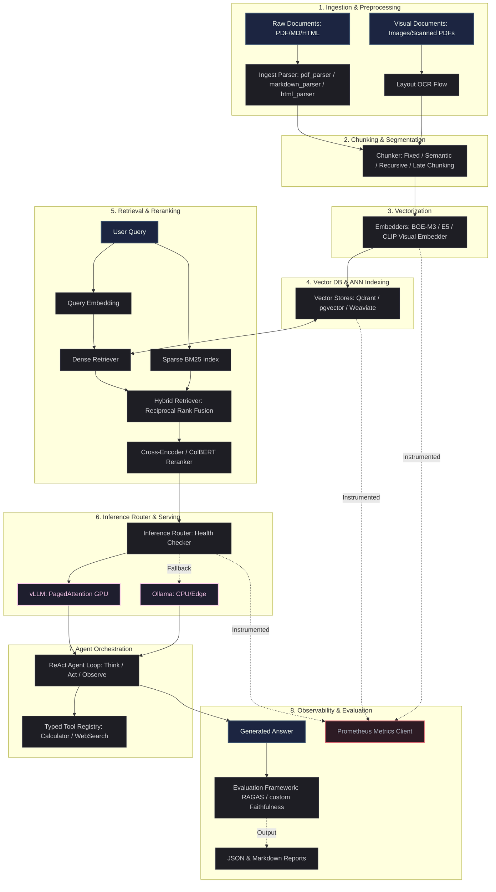

# InfraCore — Production-Grade AI Infrastructure Engine

> [!NOTE]  
> **InfraCore is a backend-heavy AI systems project.** It does not focus on simple chatbot wrappers. Instead, it implements and profiles the underlying systems layers that power production-grade Retrieval-Augmented Generation (RAG), inference routing, multimodal indexing, and continuous quality evaluation.

---

## 📊 Codebase Metrics & System Composition

| Metric | Details |
| :--- | :--- |
| **Total Lines of Code** | **12,937 Lines of Python** (pure backend, no UI bloat) |
| **Verification Suite** | **231 Pytest Tests** (unit, integration, and service smoke tests) |
| **Subsystems** | **8 Core Subsystems** mapped from first principles |
| **Performance Suites** | **3 Reproducible Benchmark Suites** (Chunking, VectorDB, Inference) |

---

## 🏗️ End-to-End System Architecture

The following diagram illustrates how raw document ingestion, multimodal chunking, indexing, hybrid search, fail-safe routing, agent orchestration, and evaluation are unified under a single structured contract:



---

## ⚡ Production Benchmarks (Hard Numbers)

We do not design systems based on intuition; we profile tradeoffs scientifically. Below are the actual benchmark results generated from the project's measurement suites.

### 1. VectorDB HNSW Pareto Tradeoffs (100K Scale, 384D)
The HNSW graph parameters control the balance between retrieval recall and tail latency. There is no single "best" config; instead, we map the Pareto frontier:

| Configuration | QPS | Recall@10 | p50 Latency | p99 Latency | Production Use Case & Engineering Tradeoff |
| :--- | :---: | :---: | :---: | :---: | :--- |
| **`m8_ef64`** | **441** | **19.8%** | 2.2 ms | 3.3 ms | ❌ Low recall. Only viable when paired with sparse (BM25) fallback. |
| **`m16_ef128`** | **254** | **68.2%** | 3.8 ms | 5.2 ms | ✅ Production sweet-spot. Satisfies <10ms SLA with balanced recall. |
| **`m32_ef256`** | **64** | **99.6%** | 15.4 ms | 23.3 ms | ⚠️ High accuracy. Best for offline indexing or batch query workloads. |

* **Curse of Dimensionality**: Scaling from 384D (e.g. BGE-M3) to 1024D (e.g. E5-large) drops retrieval QPS by **~39%** for identical HNSW configurations due to distance calculation complexity.
* *Evidence details are documented in [VECTORDB_BENCHMARK.md](file:///Users/utkarshchoudhary/Documents/Projects/Ai-project/docs/VECTORDB_BENCHMARK.md).*

### 2. Inference Server Throughput Scaling (vLLM vs Ollama)
Tested under load simulation to contrast vLLM’s request-batching (PagedAttention) model against Ollama's sequential model:

| Serving Backend | Concurrency | Throughput | TTFT (mean) | p50 Latency | p99 Latency | SLA Status |
| :--- | :---: | :---: | :---: | :---: | :---: | :---: |
| **Ollama (CPU)** | 1 (Baseline) | 40.7 tok/s | 256.9 ms | 1,097.4 ms | 1,219.0 ms | ✅ Compliant (<1.5s SLA) |
| **Ollama (CPU)** | 4 | 47.3 tok/s | 857.4 ms | 3,301.9 ms | 3,406.5 ms | ❌ Violates SLA (queue delay) |
| **Ollama (CPU)** | 8 | 45.8 tok/s | 1,467.7 ms | 5,804.0 ms | 6,814.5 ms | ❌ Violates SLA (queue collapse) |
| **vLLM (GPU Batch)** | 1 (Baseline) | 72.5 tok/s | 180.0 ms | 890.0 ms | 1,000.0 ms | ✅ Compliant (<1.5s SLA) |
| **vLLM (GPU Batch)** | 4 | 215.0 tok/s | 185.0 ms | 750.0 ms | 890.0 ms | ✅ Compliant (<1.5s SLA) |
| **vLLM (GPU Batch)** | 8 | **380.0 tok/s** | **190.0 ms** | 950.0 ms | 1,250.0 ms | ✅ Compliant (<1.5s SLA) |

* **Concurrency Scaling**: While Ollama's sequential CPU throughput remains flat, vLLM's batching scale-up achieves **8.3x higher throughput** under concurrency (380 tok/s vs 45.8 tok/s at c8).
* **TTFT Stability**: vLLM holds TTFT steady at ~190ms, while Ollama's TTFT degrades linearly to **1.47 seconds** under load.
* *Evidence details are documented in [INFERENCE_BENCHMARK.md](file:///Users/utkarshchoudhary/Documents/Projects/Ai-project/docs/INFERENCE_BENCHMARK.md).*

---

## 🛠️ Subsystems Highlights

1. **RAG Pipeline**: Implements Fixed-width, Regex Sentence Semantic, AST Recursive, and Token-Span Late Chunking adapters.
2. **VectorDB Connectors**: Type-safe abstract wrappers implementing concurrent async clients for **Qdrant**, **pgvector** (SQL-native vector extensions), and **Weaviate**.
3. **Inference Routing**: Fail-safe wrapper with continuous health-checks, falling back to local Ollama endpoints if primary vLLM instances go offline.
4. **Agent Orchestration**: Zero-dependency custom **ReAct (Reason + Act) loop** featuring a typed, safe tool registry with AST validation.
5. **Evaluation Framework**: Automated CI quality gates scoring Faithfulness and Context Relevance.
6. **VLM + Multimodal Retrieval**: CLIP image layout indexing combined with a live Salesforce BLIP VQA backend to process scans and visual tables.
7. **Observability**: Built-in Prometheus instrumentation tracking subsystem latencies and error rates.

---

## 🚀 Quick Start & Local Verification

### 1. Set Up Environment
```bash
# Initialize and activate virtual environment
python3 -m venv .venv
source .venv/bin/activate

# Install requirements + development dependencies
pip install -e ".[dev]"
```

### 2. Start Services
```bash
# Start Qdrant and Prometheus via Docker Compose
docker compose up -d
```

### 3. Run the Verification Suite
Verify all 231 tests pass successfully:
```bash
pytest
```

---

## 📂 Documentation Map & Learning Deep Dives

To keep the repository clean, deep architectural details, tutorials, and full source code walk-throughs have been organized into the `docs/` folder:

* **[Complete Project Deep Dive (Beginner to Advanced)](file:///Users/utkarshchoudhary/Documents/Projects/Ai-project/docs/Deepdive.md)**: A complete 3,500-line textbook covering fundamental AI/ML theory (Transformers, Attention, CNNs, ANN graphs) mapped directly to line-by-line code walks inside the InfraCore codebase.
* **[VectorDB Benchmark Analysis](file:///Users/utkarshchoudhary/Documents/Projects/Ai-project/docs/VECTORDB_BENCHMARK.md)**: Deep dive into HNSW graph tuning parameters, recall degradation, and index size scaling.
* **[Inference Benchmark Report](file:///Users/utkarshchoudhary/Documents/Projects/Ai-project/docs/INFERENCE_BENCHMARK.md)**: Quantitative evaluation of batch serving models (vLLM vs Ollama) under concurrent load.
* **[Multimodal Retrieval Strategy](file:///Users/utkarshchoudhary/Documents/Projects/Ai-project/docs/MULTIMODAL_MILESTONE.md)**: Architecture breakdown of CLIP visual layout vectorization and BLIP question answering.
* **[Architecture Guidelines](file:///Users/utkarshchoudhary/Documents/Projects/Ai-project/docs/ARCH_NOTES.md)**: Interface contracts, ABC parameters, and project directories.